# Diseño de Arquitectura BIAN 13 — Savings Account, Current Account, Credit Card, Debit Card, Payment Order y Customer Product and Service Directory

## Contexto

El objetivo es diseñar la interacción entre los Service Domains (SD) de productos bancarios del framework BIAN v13 con el SD de directorio de cliente y el SD de pagos:
- **Savings Account (SA)**
- **Current Account (CA)**
- **Credit Card (CC)**
- **Debit Card (DC)**
- **Payment Order (PO)** — transferencias entre cuentas y pago de tarjetas
- **Customer Product and Service Directory (CPSD)**

La preocupación central es: ¿qué identificadores se comparten entre estos SDs, quién los genera, y cómo se referencian en las APIs?

---

## 1. Caracterización de cada Service Domain (BIAN 13)

| SD | Functional Pattern | Asset Type | Control Record | ID primario (BIAN) |
|---|---|---|---|---|
| Customer Product and Service Directory | Administer | Customer Product and Service Directory Entry | CustomerProductAndServiceDirectoryEntry | `customerProductAndServiceDirectoryEntryId` |
| Savings Account | Fulfill | Savings Account Fulfillment Arrangement | SavingsAccountFulfillmentArrangement | `savingsAccountId` |
| Current Account | Fulfill | Current Account Fulfillment Arrangement | CurrentAccountFulfillmentArrangement | `currentAccountId` |
| Credit Card | Fulfill | Credit Card Fulfillment Arrangement | CreditCardFulfillmentArrangement | `creditCardId` |
| Debit Card | Fulfill | Debit Card Fulfillment Arrangement | DebitCardFulfillmentArrangement | `debitCardId` |
| Payment Order | Fulfill | Payment Order Procedure | PaymentOrderProcedure | `paymentOrderId` |
| Session Dialogue | Direct | Session Dialogue | SessionDialogue | `sessionDialogueId` |
| Payment Initiation | Initiate | Payment Initiation Procedure | PaymentInitiationProcedure | `paymentInitiationId` |
| Payment Execution | Execute | Payment Execution Transaction | PaymentExecutionTransaction | `paymentExecutionTransactionId` |
| Position Keeping | Record | Position Keeping Entry | PositionKeepingEntry | `positionKeepingEntryId` |
| Customer Offer | Develop | Customer Offer Procedure | CustomerOfferProcedure | `customerOfferId` |
| Customer Product and Service Eligibility | Assess | Customer Product and Service Eligibility Assessment | CustomerProductAndServiceEligibilityAssessment | `customerEligibilityAssessmentId` |
| Sales Product Agreement | Agree | Sales Product Agreement | SalesProductAgreement | `salesProductAgreementId` |
| Party Lifecycle Management | Manage | Party Lifecycle | PartyLifecycle | `partyLifecycleId` |
| Regulatory Compliance | Comply | Regulatory Compliance Assessment | RegulatoryComplianceAssessment | `regulatoryComplianceId` |
| Guideline Compliance | Comply | Guideline Compliance Assessment | GuidelineComplianceAssessment | `guidelineComplianceId` |
| Issued Device Administration | Administer | Issued Device State | IssuedDeviceState | `issuedDeviceId` |
| Financial Accounting | Record | Financial Accounting Log | FinancialAccountingLog | `financialAccountingLogId` |
| Correspondence | Manage | Correspondence | Correspondence | `correspondenceId` |

> **Nota sobre Payment Order:** BIAN 13 clasifica Payment Order con functional pattern **Fulfill** porque gestiona el ciclo de vida completo de una instrucción de pago (desde Initiate hasta Reporting). No confundir con el patrón **Execute**, que aplica a operaciones atómicas sin estado persistente.
>
> **Nota sobre Payment Execution:** Functional pattern **Execute** — operación atómica sin estado persistente propio. Recibe la instrucción de Payment Order y delega los asientos a Position Keeping. No retiene el historial de la transacción.
>
> **Nota sobre Position Keeping:** Functional pattern **Record** — mantiene el registro contable de posiciones. Registra los asientos de débito y crédito, y solicita la autorización a los SDs de producto correspondientes (SA, CA) antes de confirmar el booking.
>
> **Nota sobre Customer Offer:** Orquesta el proceso de apertura de productos desde la perspectiva comercial — reúne elegibilidad, acuerdo y creación del producto. Es el SD que activa SA, CA, CC o DC durante una apertura iniciada por el cliente.

### Clasificación por tipo de SD

| Tipo | SDs | Rol en el ecosistema |
|---|---|---|
| **Producto** | SA, CA, CC, DC | Registran y operan productos del cliente |
| **Directorio** | CPSD | Inventario de qué productos tiene el cliente |
| **Canal** | Session Dialogue | Gestiona la sesión del cliente con el canal digital |
| **Oferta y apertura** | Customer Offer | Orquesta la apertura de productos — coordina elegibilidad, acuerdo y activación |
| **Elegibilidad** | Customer Product and Service Eligibility | Verifica qué productos puede contratar el cliente |
| **Acuerdo** | Sales Product Agreement | Genera el acuerdo contractual del producto |
| **KYC / Ciclo de vida** | Party Lifecycle Management | Verifica la identidad del cliente y sus signatarios |
| **Cumplimiento regulatorio** | Regulatory Compliance, Guideline Compliance | Validan que la operación cumple regulación e políticas internas |
| **Iniciación de pago** | Payment Initiation | Registra y valida la solicitud de pago del cliente antes de entregarla a Payment Order |
| **Orquestación de pago** | Payment Order | Orquesta el ciclo de vida completo de una instrucción de pago |
| **Ejecución** | Payment Execution | Ejecuta la transacción de pago de forma atómica (patrón Execute) |
| **Contabilidad** | Position Keeping, Financial Accounting | Position Keeping registra asientos y autoriza con SA/CA; Financial Accounting mantiene el libro contable |
| **Dispositivo** | Issued Device Administration | Vincula el producto a dispositivos del cliente (tarjeta, token) |
| **Comunicaciones** | Correspondence | Notificaciones y comunicados al cliente |

> **Cadena de ejecución para pagos internos:** Session Dialogue → Payment Initiation → Payment Order → Payment Execution → Position Keeping → SA/CA (autorización del booking). Payment Order no escribe directamente en SA o CA — delega la ejecución contable a Payment Execution y Position Keeping.
>
> **Cadena de apertura de cuenta:** Session Dialogue → Customer Offer → [Party Reference Data, Eligibility, Product Directory] → Savings Account → [Sales Product Agreement, Position Keeping, Regulatory Compliance, Payment Order, Issued Device Administration] → Customer Product and Service Directory.

### Diferencia clave entre Credit Card y Debit Card en BIAN

| | Credit Card | Debit Card |
|---|---|---|
| Producto independiente | Sí — crea su propia línea de crédito | No — es accesorio de una SA o CA existente |
| Entrada CPSD propia | Sí | Sí (entrada separada, con `settlementAccountReference` apuntando a SA/CA) |
| Identificador bancario | PAN (16 dígitos numérico) | PAN (16 dígitos numérico) |
| Expuesto en API | Tokenizado / Enmascarado | Tokenizado / Enmascarado |
| Referencia adicional obligatoria | `customerAgreementReference` (acuerdo propio) | `settlementAccountReference` → UUID de SA o CA |
| `customerAgreementReference` | Propio — genera nuevo acuerdo de crédito | Heredado del SA/CA vinculado — DC no crea acuerdo propio |

---

## 2. Mapa de Identificadores Compartidos

Cada identificador tiene un **maestro** (quien lo genera) y **consumidores** (quienes lo referencian).

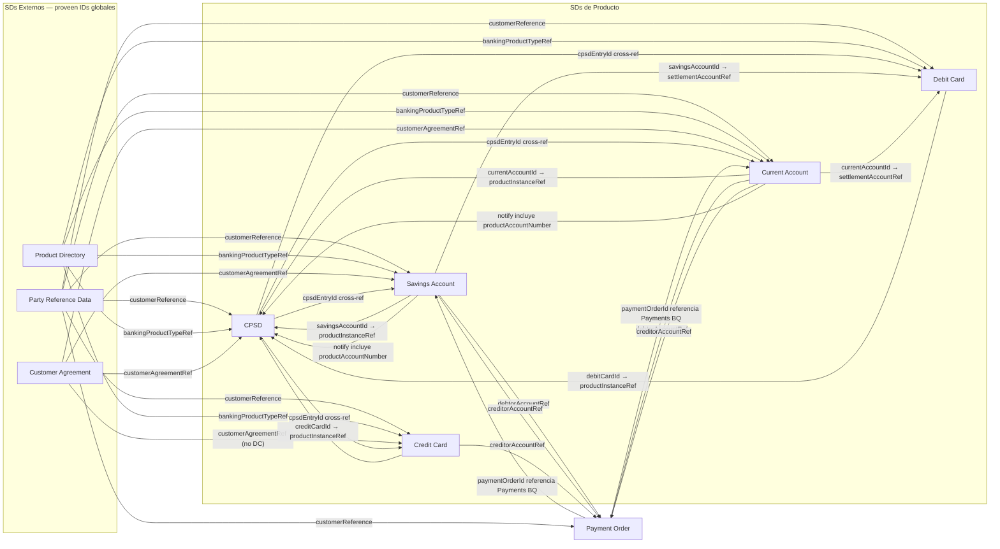

### Regla de oro:
- **CPSD** = registro maestro de **QUÉ productos tiene un cliente**.
- **SA, CA, CC, DC** = registros maestros de **CÓMO se opera cada producto**.
- **DC es el único SD de producto que referencia a otro SD de producto** (SA o CA como cuenta de liquidación).
- **Payment Order es el SD transaccional**: consume los UUIDs de SA, CA y CC como `debtorAccountReference` y `creditorAccountReference`. No gestiona productos, gestiona instrucciones de movimiento.

---

## 3. Formatos de Identificadores — Estándar BIAN 13

BIAN 13 distingue capas de identificadores con formatos distintos:

| Capa | Tipo de ID | Formato | Ejemplo |
|---|---|---|---|
| **BIAN CR Reference ID** | Técnico — instancia del SD | **UUID v4** | `3fa85f64-5717-4562-b3fc-2c963f66afa6` |
| **Account Number** | Negocio — depósitos (SA/CA) | Numérico 10 dígitos | `0012345678` |
| **Card Number (PAN)** | Negocio — tarjetas (CC/DC) | Numérico 16 dígitos (Luhn) | `4532015112830366` |
| **Card Token** | API — reemplaza PAN en tránsito | Alfanumérico opaco | `tok_4Bc9XfZ2mRqL8nP1` |
| **Card Masked** | Display — lo que ve el cliente | `****` + últimos 4 dígitos | `****0366` |
| **Customer Reference** | Técnico — identifica al cliente | **UUID v4** | `a1b2c3d4-e5f6-7890-abcd-ef1234567890` |
| **Product Type Reference** | Catálogo — tipo de producto | Alfanumérico con prefijo | `SAV-001`, `CUR-001`, `CRC-001`, `DBC-001` |
| **Payment Order Reference** | Técnico — instancia de Payment Order SD | **UUID v4** | `c1d2e3f4-a5b6-7c8d-9e0f-1a2b3c4d5e6f` |
| **Payment Transaction Reference** | Técnico — transacción ejecutada | **UUID v4** | `d2e3f4a5-b6c7-8d9e-0f1a-2b3c4d5e6f7a` |

### Regla de seguridad para tarjetas:
> El **PAN completo nunca viaja en las APIs BIAN**. Los endpoints exponen siempre `cardNumberMasked` o `cardToken`. El PAN reside encriptado en el core de tarjetas (HSM). Esta distinción es obligatoria por PCI-DSS.

---

## 4. Estructura de Control Records y Atributos Clave

### Customer Product and Service Directory — Control Record

```json
{
  "customerProductAndServiceDirectoryEntryId": "b7e23ec2-9cc0-4b27-a3f5-1d8a07cd8e2f",
  "customerReference": "a1b2c3d4-e5f6-7890-abcd-ef1234567890",
  "bankingProductTypeReference": "SAV-001",
  "customerAgreementReference": "f47ac10b-58cc-4372-a567-0e02b2c3d479",
  "productInstanceReference": "3fa85f64-5717-4562-b3fc-2c963f66afa6",
  "productAccountNumber": "0012345678",
  "productAccountHolderName": "Juan García",
  "productServiceStatus": "Active",
  "productInitiationDate": "2024-01-15"
}
```

> `productAccountNumber` es una extensión al Control Record estándar de BIAN. Almacena el número de cuenta bancario visible al cliente, recibido desde SA o CA en el momento del `notify`. Permite que CPSD sea el **único punto de resolución** `accountNumber → UUID` para transferencias a terceros, evitando llamadas directas a SA o CA.

### Savings Account — Control Record

```json
{
  "savingsAccountId": "3fa85f64-5717-4562-b3fc-2c963f66afa6",
  "accountNumber": "0012345678",
  "customerReference": "a1b2c3d4-e5f6-7890-abcd-ef1234567890",
  "bankingProductTypeReference": "SAV-001",
  "customerAgreementReference": "f47ac10b-58cc-4372-a567-0e02b2c3d479",
  "customerProductAndServiceDirectoryEntryReference": "b7e23ec2-9cc0-4b27-a3f5-1d8a07cd8e2f",
  "accountCurrency": "USD",
  "accountStatus": "Active"
}
```

### Current Account — Control Record

```json
{
  "currentAccountId": "9c7e6b5a-4d3f-2e1d-0c9b-8a7f6e5d4c3b",
  "accountNumber": "0098765432",
  "customerReference": "a1b2c3d4-e5f6-7890-abcd-ef1234567890",
  "bankingProductTypeReference": "CUR-001",
  "customerAgreementReference": "f47ac10b-58cc-4372-a567-0e02b2c3d479",
  "customerProductAndServiceDirectoryEntryReference": "c8d9e0f1-a2b3-4c5d-6e7f-8a9b0c1d2e3f",
  "accountCurrency": "USD",
  "accountStatus": "Active"
}
```

### Credit Card — Control Record

```json
{
  "creditCardId": "e2f3a4b5-c6d7-8e9f-0a1b-2c3d4e5f6a7b",
  "cardNumberMasked": "****0366",
  "cardToken": "tok_4Bc9XfZ2mRqL8nP1",
  "customerReference": "a1b2c3d4-e5f6-7890-abcd-ef1234567890",
  "bankingProductTypeReference": "CRC-001",
  "customerAgreementReference": "f47ac10b-58cc-4372-a567-0e02b2c3d479",
  "customerProductAndServiceDirectoryEntryReference": "d1e2f3a4-b5c6-7d8e-9f0a-1b2c3d4e5f6a",
  "creditLimitAmount": { "amount": 5000.00, "currency": "USD" },
  "cardExpiryDate": "2027-01",
  "cardStatus": "Active"
}
```

> `creditCardId` = UUID (BIAN layer)
> `cardToken` = token alfanumérico para uso en APIs (reemplaza al PAN)
> `cardNumberMasked` = solo para display

### Debit Card — Control Record

```json
{
  "debitCardId": "f3a4b5c6-d7e8-9f0a-1b2c-3d4e5f6a7b8c",
  "cardNumberMasked": "****7891",
  "cardToken": "tok_7Zx2YwQ9mNpR3sK6",
  "customerReference": "a1b2c3d4-e5f6-7890-abcd-ef1234567890",
  "bankingProductTypeReference": "DBC-001",
  "customerProductAndServiceDirectoryEntryReference": "e4f5a6b7-c8d9-0e1f-2a3b-4c5d6e7f8a9b",
  "settlementAccountReference": "9c7e6b5a-4d3f-2e1d-0c9b-8a7f6e5d4c3b",
  "cardExpiryDate": "2027-01",
  "cardStatus": "Active"
}
```

> **`customerAgreementReference` ausente por diseño:** DC no genera un acuerdo propio. El acuerdo (`customerAgreementReference`) fue creado cuando se abrió la SA o CA vinculada y pertenece a ese producto. DC hereda el alcance del acuerdo de forma implícita a través del `settlementAccountReference`. Incluirlo en DC crearía duplicación y ambigüedad sobre cuál acuerdo aplica.
>
> `settlementAccountReference` = UUID del Current Account o Savings Account al que está vinculada la tarjeta de débito. Es el identificador cruzado más importante del Debit Card SD.

### Payment Order — Control Record

```json
{
  "paymentOrderId": "c1d2e3f4-a5b6-7c8d-9e0f-1a2b3c4d5e6f",
  "paymentOrderStatus": "Initiated",
  "paymentOrderType": "InternalTransfer",
  "customerReference": "a1b2c3d4-e5f6-7890-abcd-ef1234567890",
  "debtorAccountReference": "9c7e6b5a-4d3f-2e1d-0c9b-8a7f6e5d4c3b",
  "creditorAccountReference": "3fa85f64-5717-4562-b3fc-2c963f66afa6",
  "paymentAmount": { "amount": 500.00, "currency": "USD" },
  "paymentDate": "2024-01-15",
  "paymentDescription": "Transferencia a cuenta de ahorros",
  "paymentTransactionReference": null
}
```

> `paymentTransactionReference` es `null` al momento del Initiate. Se genera y popula **únicamente después de la ejecución exitosa** del pago, disponible en el BQ `Reporting`. Incluirlo en el Control Record al momento de creación sería un error de lifecycle.
>
> `debtorAccountReference` y `creditorAccountReference` son siempre **UUID v4** de los SDs de producto (SA, CA o CC). **Nunca se usa el account number bancario** para referenciar cuentas entre SDs — ese número es solo un atributo de negocio dentro del Control Record del producto.

#### Variantes del `paymentOrderType` según el caso de uso

| `paymentOrderType` | Debtor | Creditor | Escenario |
|---|---|---|---|
| `InternalTransfer` | `savingsAccountId` o `currentAccountId` | `savingsAccountId` o `currentAccountId` | Transferencia entre cuentas del mismo banco |
| `CardPayment` | `savingsAccountId` o `currentAccountId` | `creditCardId` | Pago a tarjeta de crédito del mismo banco |
| `ExternalTransfer` | `savingsAccountId` o `currentAccountId` | `null` (datos en BQ `PaymentMechanism`) | Transferencia a cuenta de banco externo (ACH/SWIFT) |
| `PushToCard` | `savingsAccountId` o `currentAccountId` | `null` (cardToken en BQ `PaymentMechanism`) | Envío a tarjeta de banco externo (Visa Direct / Mastercard Send) |

---

## 5. API Design — Endpoints por Service Domain (BIAN 13)

BIAN 13 sigue el patrón: `/{sd-name}/{cr-reference-id}/[bq-name/{bq-reference-id}/]action`

### 5.1 Customer Product and Service Directory APIs

```
# Registrar nueva entrada en el directorio (aplica a cualquier producto: SAV, CUR, CRC, DBC)
POST   /customer-product-and-service-directory/initiate
       Body: {
         "customerReference": "a1b2c3d4-e5f6-7890-abcd-ef1234567890",
         "bankingProductTypeReference": "SAV-001",
         "customerAgreementReference": "f47ac10b-58cc-4372-a567-0e02b2c3d479"
       }
       Response: {
         "customerProductAndServiceDirectoryEntryId": "b7e23ec2-9cc0-4b27-a3f5-1d8a07cd8e2f"
       }

# Consultar todos los productos de un cliente (vista 360°)
GET    /customer-product-and-service-directory/retrieve
       ?customerReference=a1b2c3d4-e5f6-7890-abcd-ef1234567890
       Response: [
         {
           "customerProductAndServiceDirectoryEntryId": "b7e23ec2-...",
           "bankingProductTypeReference": "SAV-001",
           "productInstanceReference": "3fa85f64-...",
           "productAccountNumber": "0012345678",
           "productAccountHolderName": "Juan García",
           "productServiceStatus": "Active"
         },
         {
           "customerProductAndServiceDirectoryEntryId": "d1e2f3a4-...",
           "bankingProductTypeReference": "CRC-001",
           "productInstanceReference": "e2f3a4b5-...",
           "productAccountNumber": null,
           "productServiceStatus": "Active"
         },
         {
           "customerProductAndServiceDirectoryEntryId": "e4f5a6b7-...",
           "bankingProductTypeReference": "DBC-001",
           "productInstanceReference": "f3a4b5c6-...",
           "productAccountNumber": null,
           "productServiceStatus": "Active"
         }
       ]

# [EXTENSIÓN] Resolver número de cuenta a UUID — para transferencias a terceros
# No es endpoint BIAN estándar; es una extensión al CPSD que evita buscar en SA/CA
GET    /customer-product-and-service-directory/retrieve
       ?productAccountNumber=0098765432
       Response: {
         "customerProductAndServiceDirectoryEntryId": "c9d0e1f2-...",
         "productInstanceReference": "9c7e6b5a-4d3f-2e1d-0c9b-8a7f6e5d4c3b",
         "productAccountNumber": "0098765432",
         "productAccountHolderName": "María López",
         "bankingProductTypeReference": "CUR-001",
         "productServiceStatus": "Active"
       }

# Recuperar una entrada específica
GET    /customer-product-and-service-directory/{cpsd-entry-id}/retrieve

# Actualizar entrada (vincular productInstanceReference)
PUT    /customer-product-and-service-directory/{cpsd-entry-id}/update
       Body: {
         "productInstanceReference": "e2f3a4b5-c6d7-8e9f-0a1b-2c3d4e5f6a7b",
         "productServiceStatus": "Active"
       }

# Recibir notificación desde SA o CA (incluye accountNumber para resolución futura)
# El BQ "DirectoryEntry" agrupa las operaciones de actualización del registro de producto
# dentro de CPSD. Aunque el patrón Administer no define BQs formales en el spec base,
# BIAN 13 permite extender con BQs operacionales para notificaciones entre SDs.
PUT    /customer-product-and-service-directory/{cpsd-entry-id}/directory-entry/{bq-id}/notify
       Body: {
         "notificationType": "AccountOpened",
         "productInstanceReference": "3fa85f64-5717-4562-b3fc-2c963f66afa6",
         "productAccountNumber": "0012345678",
         "productAccountHolderName": "Juan García"
       }

# Recibir notificación desde CC o DC (sin accountNumber — tarjetas no tienen número de cuenta)
PUT    /customer-product-and-service-directory/{cpsd-entry-id}/directory-entry/{bq-id}/notify
       Body: {
         "notificationType": "CardIssued",
         "productInstanceReference": "e2f3a4b5-c6d7-8e9f-0a1b-2c3d4e5f6a7b"
       }

# Cerrar entrada
PUT    /customer-product-and-service-directory/{cpsd-entry-id}/control
       Body: { "customerProductAndServiceDirectoryEntryActionType": "Terminate" }
```

### 5.2 Savings Account APIs

```
POST   /savings-account/initiate
       Body: {
         "customerReference": "a1b2c3d4-e5f6-7890-abcd-ef1234567890",
         "bankingProductTypeReference": "SAV-001",
         "customerAgreementReference": "f47ac10b-58cc-4372-a567-0e02b2c3d479",
         "customerProductAndServiceDirectoryEntryReference": "b7e23ec2-9cc0-4b27-a3f5-1d8a07cd8e2f"
       }
       Response: {
         "savingsAccountId": "3fa85f64-5717-4562-b3fc-2c963f66afa6",
         "accountNumber": "0012345678"
       }

GET    /savings-account/3fa85f64-5717-4562-b3fc-2c963f66afa6/retrieve
PUT    /savings-account/3fa85f64-5717-4562-b3fc-2c963f66afa6/update
PUT    /savings-account/3fa85f64-5717-4562-b3fc-2c963f66afa6/control
       Body: { "savingsAccountFulfillmentArrangementActionType": "Terminate" }

# BQ: Interest
GET    /savings-account/3fa85f64-5717-4562-b3fc-2c963f66afa6/interest/{bq-id}/retrieve
POST   /savings-account/3fa85f64-5717-4562-b3fc-2c963f66afa6/interest/{bq-id}/execute

# BQ: Payments
POST   /savings-account/3fa85f64-5717-4562-b3fc-2c963f66afa6/payments/{bq-id}/initiate
GET    /savings-account/3fa85f64-5717-4562-b3fc-2c963f66afa6/payments/{bq-id}/retrieve
```

### 5.3 Current Account APIs

```
POST   /current-account/initiate
       Body: {
         "customerReference": "a1b2c3d4-e5f6-7890-abcd-ef1234567890",
         "bankingProductTypeReference": "CUR-001",
         "customerAgreementReference": "f47ac10b-58cc-4372-a567-0e02b2c3d479",
         "customerProductAndServiceDirectoryEntryReference": "c8d9e0f1-a2b3-4c5d-6e7f-8a9b0c1d2e3f"
       }
       Response: {
         "currentAccountId": "9c7e6b5a-4d3f-2e1d-0c9b-8a7f6e5d4c3b",
         "accountNumber": "0098765432"
       }

GET    /current-account/9c7e6b5a-4d3f-2e1d-0c9b-8a7f6e5d4c3b/retrieve
PUT    /current-account/9c7e6b5a-4d3f-2e1d-0c9b-8a7f6e5d4c3b/update
PUT    /current-account/9c7e6b5a-4d3f-2e1d-0c9b-8a7f6e5d4c3b/control

# BQs específicos de CA:
GET    /current-account/9c7e6b5a-4d3f-2e1d-0c9b-8a7f6e5d4c3b/overdraft/{bq-id}/retrieve
PUT    /current-account/9c7e6b5a-4d3f-2e1d-0c9b-8a7f6e5d4c3b/overdraft/{bq-id}/update
POST   /current-account/9c7e6b5a-4d3f-2e1d-0c9b-8a7f6e5d4c3b/payments/{bq-id}/initiate
POST   /current-account/9c7e6b5a-4d3f-2e1d-0c9b-8a7f6e5d4c3b/service-fees/{bq-id}/execute
```

### 5.4 Credit Card APIs

```
# Emitir tarjeta de crédito
POST   /credit-card/initiate
       Body: {
         "customerReference": "a1b2c3d4-e5f6-7890-abcd-ef1234567890",
         "bankingProductTypeReference": "CRC-001",
         "customerAgreementReference": "f47ac10b-58cc-4372-a567-0e02b2c3d479",
         "customerProductAndServiceDirectoryEntryReference": "d1e2f3a4-b5c6-7d8e-9f0a-1b2c3d4e5f6a",
         "creditLimitAmount": { "amount": 5000.00, "currency": "USD" }
       }
       Response: {
         "creditCardId": "e2f3a4b5-c6d7-8e9f-0a1b-2c3d4e5f6a7b",
         "cardToken": "tok_4Bc9XfZ2mRqL8nP1",
         "cardNumberMasked": "****0366",
         "cardExpiryDate": "2027-01"
       }

# Recuperar tarjeta
GET    /credit-card/e2f3a4b5-c6d7-8e9f-0a1b-2c3d4e5f6a7b/retrieve

# Actualizar límite u otros parámetros
PUT    /credit-card/e2f3a4b5-c6d7-8e9f-0a1b-2c3d4e5f6a7b/update
       Body: { "creditLimitAmount": { "amount": 8000.00, "currency": "USD" } }

# BQ: CreditTransfer — usar crédito disponible
POST   /credit-card/e2f3a4b5-c6d7-8e9f-0a1b-2c3d4e5f6a7b/credit-transfer/{bq-id}/initiate

# BQ: Billing — consultar estado de cuenta
GET    /credit-card/e2f3a4b5-c6d7-8e9f-0a1b-2c3d4e5f6a7b/billing/{bq-id}/retrieve

# BQ: Repayment — registrar pago de la tarjeta
POST   /credit-card/e2f3a4b5-c6d7-8e9f-0a1b-2c3d4e5f6a7b/repayment/{bq-id}/initiate
       Body: {
         "repaymentAmount": { "amount": 500.00, "currency": "USD" },
         "settlementAccountReference": "9c7e6b5a-4d3f-2e1d-0c9b-8a7f6e5d4c3b"
       }

# BQ: Interest — calcular intereses
GET    /credit-card/e2f3a4b5-c6d7-8e9f-0a1b-2c3d4e5f6a7b/interest/{bq-id}/retrieve
POST   /credit-card/e2f3a4b5-c6d7-8e9f-0a1b-2c3d4e5f6a7b/interest/{bq-id}/execute

# Cancelar tarjeta
PUT    /credit-card/e2f3a4b5-c6d7-8e9f-0a1b-2c3d4e5f6a7b/control
       Body: { "creditCardFulfillmentArrangementActionType": "Terminate" }
```

### 5.5 Debit Card APIs

```
# Emitir tarjeta de débito vinculada a una cuenta (CA o SA)
# Nota: no incluye customerAgreementReference — DC hereda el acuerdo del SA/CA vinculado
POST   /debit-card/initiate
       Body: {
         "customerReference": "a1b2c3d4-e5f6-7890-abcd-ef1234567890",
         "bankingProductTypeReference": "DBC-001",
         "customerProductAndServiceDirectoryEntryReference": "e4f5a6b7-c8d9-0e1f-2a3b-4c5d6e7f8a9b",
         "settlementAccountReference": "9c7e6b5a-4d3f-2e1d-0c9b-8a7f6e5d4c3b"
       }
       Response: {
         "debitCardId": "f3a4b5c6-d7e8-9f0a-1b2c-3d4e5f6a7b8c",
         "cardToken": "tok_7Zx2YwQ9mNpR3sK6",
         "cardNumberMasked": "****7891",
         "cardExpiryDate": "2027-01"
       }

# Recuperar tarjeta
GET    /debit-card/f3a4b5c6-d7e8-9f0a-1b2c-3d4e5f6a7b8c/retrieve

# BQ: Authorization — autorizar transacción en POS/ATM
POST   /debit-card/f3a4b5c6-d7e8-9f0a-1b2c-3d4e5f6a7b8c/authorization/{bq-id}/request
       Body: {
         "transactionAmount": { "amount": 150.00, "currency": "USD" },
         "merchantReference": "MERCH-XYZ-001"
       }

# BQ: Limit — consultar/actualizar límites diarios
GET    /debit-card/f3a4b5c6-d7e8-9f0a-1b2c-3d4e5f6a7b8c/limit/{bq-id}/retrieve
PUT    /debit-card/f3a4b5c6-d7e8-9f0a-1b2c-3d4e5f6a7b8c/limit/{bq-id}/update

# Bloquear / cancelar tarjeta
PUT    /debit-card/f3a4b5c6-d7e8-9f0a-1b2c-3d4e5f6a7b8c/control
       Body: { "debitCardFulfillmentArrangementActionType": "Block" }
```

### 5.6 Payment Order APIs

```
# ── TRANSFERENCIA INTERNA (SA → CA / CA → SA / SA → SA / CA → CA) ──────────

POST   /payment-order/initiate
       Body: {
         "paymentOrderType": "InternalTransfer",
         "customerReference": "a1b2c3d4-e5f6-7890-abcd-ef1234567890",
         "debtorAccountReference": "9c7e6b5a-4d3f-2e1d-0c9b-8a7f6e5d4c3b",
         "creditorAccountReference": "3fa85f64-5717-4562-b3fc-2c963f66afa6",
         "paymentAmount": { "amount": 500.00, "currency": "USD" },
         "paymentDate": "2024-01-15",
         "paymentDescription": "Transferencia a cuenta de ahorros"
       }
       Response: {
         "paymentOrderId": "c1d2e3f4-a5b6-7c8d-9e0f-1a2b3c4d5e6f",
         "paymentOrderStatus": "Initiated"
       }

# ── PAGO DE TARJETA DE CRÉDITO (CA → CC) ────────────────────────────────────

POST   /payment-order/initiate
       Body: {
         "paymentOrderType": "CardPayment",
         "customerReference": "a1b2c3d4-e5f6-7890-abcd-ef1234567890",
         "debtorAccountReference": "9c7e6b5a-4d3f-2e1d-0c9b-8a7f6e5d4c3b",
         "creditorAccountReference": "e2f3a4b5-c6d7-8e9f-0a1b-2c3d4e5f6a7b",
         "paymentAmount": { "amount": 200.00, "currency": "USD" },
         "paymentDate": "2024-01-15",
         "paymentDescription": "Pago tarjeta de crédito"
       }
       Response: {
         "paymentOrderId": "e3f4a5b6-c7d8-9e0f-1a2b-3c4d5e6f7a8b",
         "paymentOrderStatus": "Initiated"
       }

# ── TRANSFERENCIA EXTERNA (CA → banco externo vía SWIFT/ACH) ────────────────

POST   /payment-order/initiate
       Body: {
         "paymentOrderType": "ExternalTransfer",
         "customerReference": "a1b2c3d4-e5f6-7890-abcd-ef1234567890",
         "debtorAccountReference": "9c7e6b5a-4d3f-2e1d-0c9b-8a7f6e5d4c3b",
         "paymentAmount": { "amount": 1000.00, "currency": "USD" },
         "paymentDate": "2024-01-15",
         "paymentDescription": "Transferencia internacional"
       }
       Response: {
         "paymentOrderId": "f4a5b6c7-d8e9-0f1a-2b3c-4d5e6f7a8b9c",
         "paymentOrderStatus": "Initiated"
       }

# ── OPERACIONES COMUNES ──────────────────────────────────────────────────────

# Consultar estado de una orden (ejemplo: estado Initiated — paymentTransactionReference aún null)
GET    /payment-order/c1d2e3f4-a5b6-7c8d-9e0f-1a2b3c4d5e6f/retrieve
       Response (durante ejecución):
       {
         "paymentOrderId": "c1d2e3f4-...",
         "paymentOrderStatus": "Initiated",
         "paymentTransactionReference": null
       }

       Response (post-ejecución exitosa):
       {
         "paymentOrderId": "c1d2e3f4-...",
         "paymentOrderStatus": "Completed",
         "paymentTransactionReference": "d2e3f4a5-b6c7-8d9e-0f1a-2b3c4d5e6f7a"
       }

# Cancelar una orden (si aún no fue ejecutada)
PUT    /payment-order/c1d2e3f4-a5b6-7c8d-9e0f-1a2b3c4d5e6f/control
       Body: { "paymentOrderActionType": "Cancel" }

# BQ: FundAvailableCheck — verificar saldo antes de ejecutar
POST   /payment-order/c1d2e3f4-a5b6-7c8d-9e0f-1a2b3c4d5e6f/fund-available-check/{bq-id}/request
       Body: { "debtorAccountReference": "9c7e6b5a-...", "checkAmount": { "amount": 500.00, "currency": "USD" } }
       Response: { "fundsAvailableIndicator": true, "availableBalance": { "amount": 2300.00, "currency": "USD" } }

# BQ: OrderConfirmation — confirmar detalles antes de procesar
PUT    /payment-order/c1d2e3f4-a5b6-7c8d-9e0f-1a2b3c4d5e6f/order-confirmation/{bq-id}/update
       Body: { "customerConfirmationIndicator": true }

# BQ: PaymentMechanism — detalle de la instrucción de pago externa (para ExternalTransfer)
PUT    /payment-order/f4a5b6c7-d8e9-0f1a-2b3c-4d5e6f7a8b9c/payment-mechanism/{bq-id}/update
       Body: {
         "paymentMechanismType": "SWIFT",
         "creditorBankBIC": "CHASUS33",
         "creditorIBAN": "US29NWBK60161331926819",
         "creditorAccountName": "John Doe"
       }

# BQ: Reporting — obtener comprobante de la transacción ejecutada
GET    /payment-order/c1d2e3f4-a5b6-7c8d-9e0f-1a2b3c4d5e6f/reporting/{bq-id}/retrieve
       Response: {
         "paymentTransactionReference": "d2e3f4a5-...",
         "executionDate": "2024-01-15T14:32:00Z",
         "debtorAccountReference": "9c7e6b5a-...",
         "creditorAccountReference": "3fa85f64-...",
         "settledAmount": { "amount": 500.00, "currency": "USD" }
       }
```

#### Alternativa para pago de tarjeta: Credit Card Repayment BQ

Para pagos automáticos/domiciliados de tarjeta dentro del mismo banco, es válido invocar el BQ `Repayment` del Credit Card SD directamente, sin pasar por Payment Order. **No usar esta alternativa cuando el pago es iniciado por el cliente desde un canal digital** — en ese caso usar Payment Order para tener `FundAvailableCheck` y posibilidad de cancelación.

```
POST   /credit-card/e2f3a4b5-c6d7-8e9f-0a1b-2c3d4e5f6a7b/repayment/{bq-id}/initiate
       Body: {
         "repaymentAmount": { "amount": 200.00, "currency": "USD" },
         "repaymentType": "MinimumPayment",
         "settlementAccountReference": "9c7e6b5a-4d3f-2e1d-0c9b-8a7f6e5d4c3b"
       }
```

| Cuándo usar Payment Order | Cuándo usar CC Repayment BQ |
|---|---|
| Pago desde app/canal digital con validación de fondos previa | Pago automático/domiciliado interno |
| Necesitas `FundAvailableCheck` antes de ejecutar | No requieres pre-validación |
| La orden puede ser cancelada/agendada | Ejecución inmediata |
| Transferencia a tarjeta de otro banco | Tarjeta del mismo banco |

---

## 6. Flujos de Interacción entre SDs

### Flujo 1: Apertura de Cuenta de Ahorros

> Business Scenario BIAN: *Handle Request to Open Savings Account* — view_56497

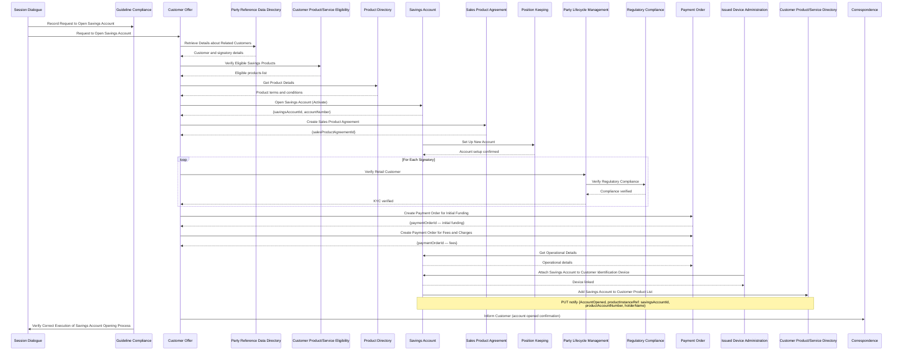

### Flujo 2: Emisión de Tarjeta de Crédito

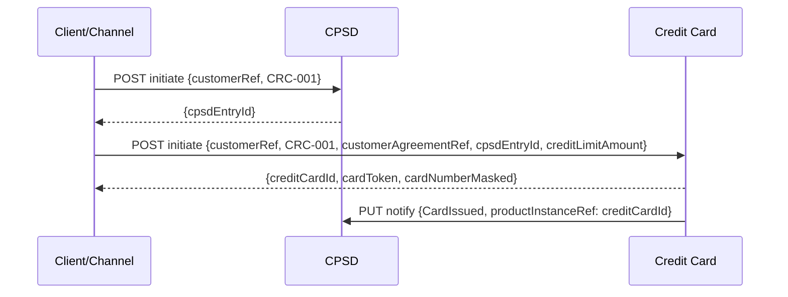

### Flujo 3: Emisión de Tarjeta de Débito (vinculada a CA existente)

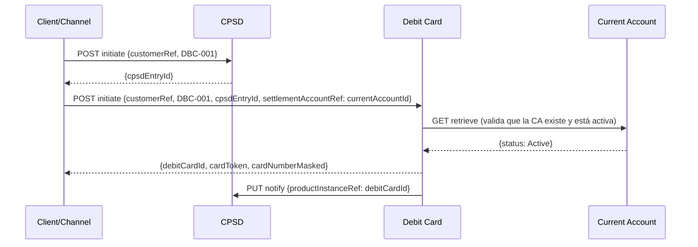

### Flujo 4: Transferencia a tercero — cuenta digitada por el cliente (intra-banco)

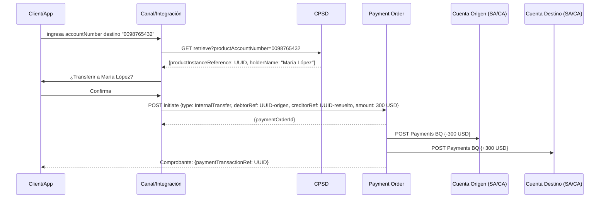

### Flujo 5: Transferencia a tercero externo (banco diferente — ACH o SWIFT)

El canal ya intentó resolver en CPSD y recibió 404, confirmando que la cuenta es externa.

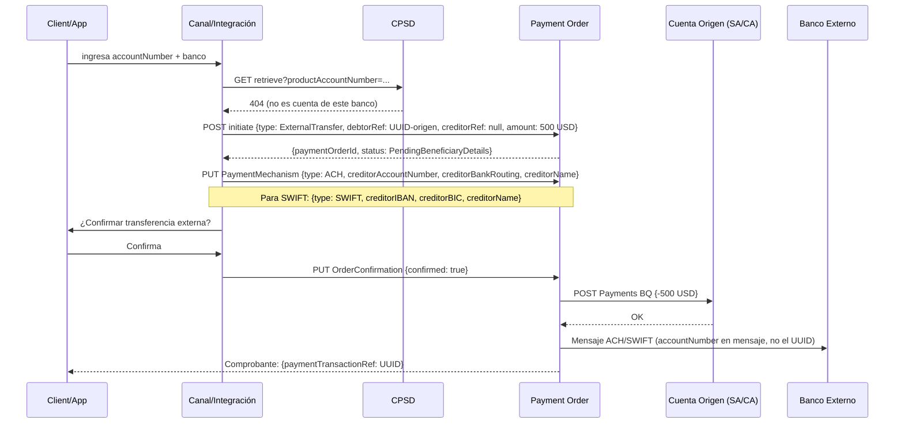

### Flujo 6: Transferencia interna entre cuentas propias (SA → CA)

> Business Scenario BIAN: *Handle Request for Internal Credit Transfer from Savings Account*

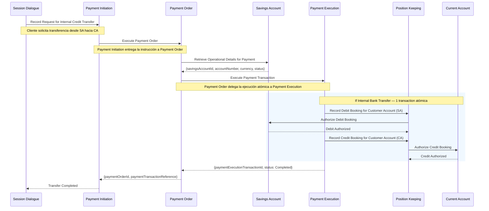

> **Nota:** Position Keeping registra los asientos contables y solicita autorización explícita a SA (débito) y CA (crédito) antes de confirmar la transacción. SA y CA no reciben órdenes de pago directamente desde Payment Order — solo autorizan bookings iniciados por Position Keeping.
>
> La anotación "See Corporate Banking Products - Bookings and Interest Management for details of Record Debit Booking and Record Credit Booking" en el diagrama BIAN indica que el detalle del asiento contable (cálculo de intereses, comisiones) está documentado en ese Business Scenario separado.

### Flujo 7: Pago de tarjeta de crédito (CA → CC via Payment Order)

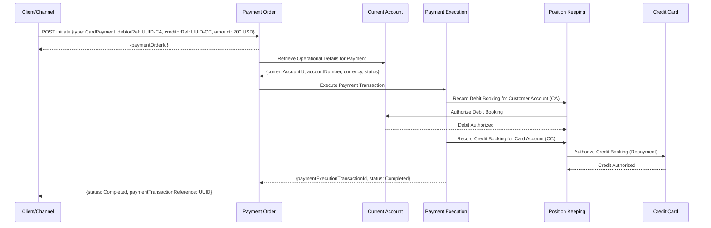

### Flujo 8: Transferencia con PAN de tarjeta como destino

#### Caso A — PAN del mismo banco

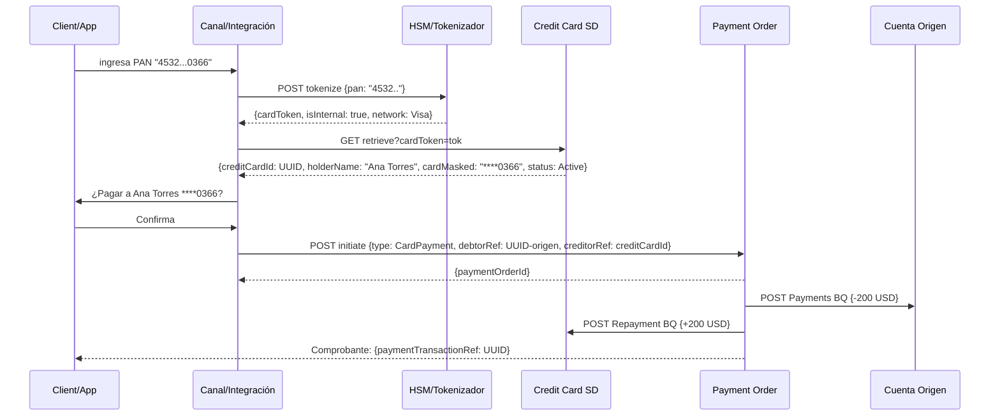

#### Caso B — PAN de banco externo (Push to Card)

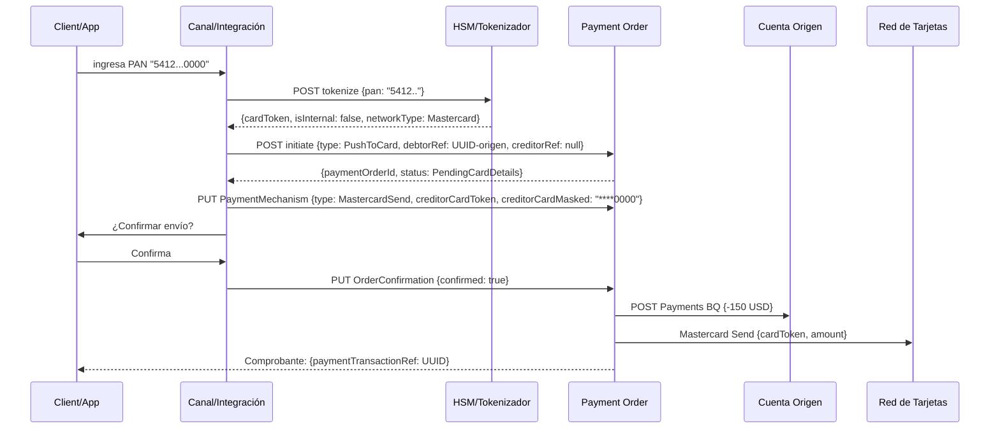

### Flujo 9: Consulta 360° del cliente (desde CPSD)

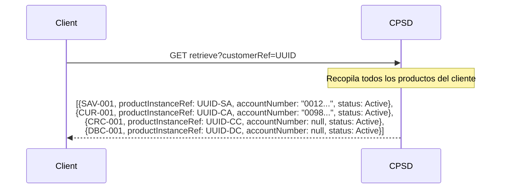

---

## 7. Tabla de Responsabilidades por Identificador

| Identificador | Formato | Ejemplo real | Generado por | Cómo se transfiere |
|---|---|---|---|---|
| `customerReference` | UUID v4 | `a1b2c3d4-e5f6-7890-abcd-ef1234567890` | Party Reference Data SD | Body del initiate |
| `bankingProductTypeReference` | `{TIPO}-{seq}` | `SAV-001`, `CUR-001`, `CRC-001`, `DBC-001` | Product Directory SD | Body del initiate |
| `customerAgreementReference` | UUID v4 | `f47ac10b-58cc-4372-a567-0e02b2c3d479` | Customer Agreement SD | Body del initiate |
| `customerProductAndServiceDirectoryEntryId` | UUID v4 | `b7e23ec2-9cc0-4b27-a3f5-1d8a07cd8e2f` | CPSD | Response del CPSD initiate — es la clave primaria del registro CPSD |
| `customerProductAndServiceDirectoryEntryReference` | UUID v4 | `b7e23ec2-9cc0-4b27-a3f5-1d8a07cd8e2f` | Tomado del CPSD initiate response | Body del initiate de SA, CA, CC, DC — **presente en el CR solo si la notificación a CPSD es síncrona** (el SD lo necesita para construir la URL del notify); en modelo asíncrono viaja en el payload del evento pero no necesita persistirse en el CR |
| `savingsAccountId` | UUID v4 | `3fa85f64-5717-4562-b3fc-2c963f66afa6` | SA | SA notifica a CPSD / recibido por DC como `settlementAccountReference` |
| `currentAccountId` | UUID v4 | `9c7e6b5a-4d3f-2e1d-0c9b-8a7f6e5d4c3b` | CA | CA notifica a CPSD / recibido por DC como `settlementAccountReference` |
| `accountNumber` (SA/CA) | Numérico 10 dígitos | `0012345678` | Core Banking | Response del SA/CA initiate — también se envía a CPSD en el notify |
| `productAccountNumber` (CPSD) | Numérico 10 dígitos | `0012345678` | Extensión CPSD — copiado desde SA/CA notify | Permite resolver `accountNumber → UUID` con una sola llamada a CPSD |
| `productAccountHolderName` (CPSD) | String | `"Juan García"` | Extensión CPSD — copiado desde SA/CA notify | Se muestra al cliente para confirmar destinatario antes de transferir |
| `creditCardId` | UUID v4 | `e2f3a4b5-c6d7-8e9f-0a1b-2c3d4e5f6a7b` | CC | CC notifica a CPSD via PUT notify |
| `cardToken` (CC) | Alfanumérico opaco | `tok_4Bc9XfZ2mRqL8nP1` | Core de Tarjetas / HSM | Response del CC initiate — sustituye al PAN en APIs |
| `cardNumberMasked` (CC) | `****NNNN` | `****0366` | Core de Tarjetas | Solo para display, nunca para operaciones |
| `debitCardId` | UUID v4 | `f3a4b5c6-d7e8-9f0a-1b2c-3d4e5f6a7b8c` | DC | DC notifica a CPSD via PUT notify |
| `cardToken` (DC) | Alfanumérico opaco | `tok_7Zx2YwQ9mNpR3sK6` | Core de Tarjetas / HSM | Response del DC initiate |
| `settlementAccountReference` | UUID v4 | `9c7e6b5a-4d3f-2e1d-0c9b-8a7f6e5d4c3b` | Tomado del CA o SA | Body del DC initiate — único ID cruzado obligatorio entre SDs de producto |
| `paymentOrderId` | UUID v4 | `c1d2e3f4-a5b6-7c8d-9e0f-1a2b3c4d5e6f` | Payment Order SD | Response del PO initiate — referenciado en Payments BQ de SA/CA y Repayment BQ de CC |
| `debtorAccountReference` | UUID v4 | `9c7e6b5a-4d3f-2e1d-0c9b-8a7f6e5d4c3b` | Tomado del SA o CA | Body del PO initiate — es el `savingsAccountId` o `currentAccountId` de la cuenta origen |
| `creditorAccountReference` | UUID v4 | `3fa85f64-5717-4562-b3fc-2c963f66afa6` | Tomado del SA, CA o CC | Body del PO initiate — es el UUID del SA, CA o CC destino |
| `paymentTransactionReference` | UUID v4 | `d2e3f4a5-b6c7-8d9e-0f1a-2b3c4d5e6f7a` | Payment Order SD (post-ejecución) | Comprobante de la transacción, disponible en Reporting BQ |

---

## 8. Consideraciones de Diseño

### Orden de orquestación — apertura de producto
1. **CPSD.Initiate** — registra la intención del producto → genera `cpsdEntryId`
2. **SD del producto.Initiate** — crea el fulfillment arrangement usando `cpsdEntryId`
3. **SD notifica a CPSD** — registra el `productInstanceReference` de vuelta

### Cadena de ejecución — pagos internos (Business Scenario BIAN)

Para transferencias internas, BIAN establece la siguiente cadena de responsabilidades:

1. **Session Dialogue** — captura la solicitud del cliente en el canal
2. **Payment Initiation** — registra y valida la solicitud antes de activar Payment Order
3. **Payment Order** — recupera detalles operativos del SD de origen (SA o CA) y delega la ejecución
4. **Payment Execution** — ejecuta la transacción de forma atómica (patrón Execute, sin estado persistente)
5. **Position Keeping** — registra los asientos de débito y crédito, solicitando autorización a cada SD de producto
6. **SA / CA / CC** — autorizan los bookings individuales (no reciben instrucciones de pago directamente desde Payment Order)

> **Implicación crítica:** Payment Order **no escribe directamente en SA ni en CA**. Delega a Payment Execution, que a su vez delega los asientos a Position Keeping. SA y CA solo participan en el paso de autorización del booking, no como receptores de una instrucción de débito/crédito directa. El `Payments BQ` de SA/CA es el mecanismo interno que Position Keeping utiliza para esa autorización.

### Notificación a CPSD: modelo síncrono vs asíncrono

El paso 3 puede implementarse de dos formas con consecuencias distintas sobre el campo `customerProductAndServiceDirectoryEntryReference` en los CRs de producto.

#### Modelo síncrono (diseño base de este documento)

El SD de producto llama directamente a CPSD después de su `initiate`:

```
SA.initiate completa
    └─► PUT /customer-product-and-service-directory/{cpsdEntryId}/directory-entry/{bq-id}/notify
```

**Implicación:** SA necesita el `cpsdEntryId` para construir la URL. Por eso lo almacena en su CR como `customerProductAndServiceDirectoryEntryReference`. Lo mismo aplica a CA, CC y DC.

#### Modelo asíncrono (notificación por eventos)

El SD de producto publica un domain event. CPSD lo consume y actualiza su propia entrada:

```
SA.initiate completa
    └─► publica evento "AccountOpened" en el bus
              └─► CPSD consume el evento y actualiza su entrada
```

**Implicación sobre el campo:**

- **Evento inicial** (`AccountOpened`, `CardIssued`): el `cpsdEntryId` llegó como input al `initiate` y puede incluirse en el payload del evento sin persistirse en el CR.
- **Eventos posteriores** (`AccountClosed`, `CardBlocked`): el producto solo necesita incluir su propio ID (`savingsAccountId`, etc.). CPSD resuelve la entrada por `productInstanceReference`, que ya almacenó al procesar el primer evento.

En consecuencia, **en el modelo asíncrono `customerProductAndServiceDirectoryEntryReference` puede omitirse del CR de todos los SDs de producto**.

#### Comparativa

| Criterio | Síncrono | Asíncrono |
|---|---|---|
| `cpsdEntryRef` en CR del producto | Necesario | No necesario |
| Coupling producto → CPSD | Directo (llamada HTTP) | Nulo (el producto solo publica eventos) |
| Consistencia de CPSD | Fuerte — inmediata | Eventual — ventana de inconsistencia entre el `initiate` del producto y el procesamiento del evento |
| Vista 360° disponible | Inmediatamente tras el `initiate` | Solo después de que CPSD procese el evento |
| Complejidad del orquestador | Menor | Mayor (debe gestionar idempotencia, ordering y reintento de eventos) |

> **Regla práctica:** si el sistema garantiza que CPSD procesa el evento antes de que cualquier canal pueda consultar la vista 360° del cliente (ventana suficientemente corta o canal espera confirmación), el modelo asíncrono es preferible porque elimina el acoplamiento directo entre los SDs de producto y CPSD. Si no puede garantizarse esa ventana, el modelo síncrono evita inconsistencias visibles al cliente.

### Particularidad del Debit Card
- El DC **requiere** que SA o CA ya exista antes de emitirse.
- El `settlementAccountReference` en el body del `debit-card/initiate` es el UUID del SA o CA — no el `accountNumber`.
- DC valida la existencia y estado activo de la cuenta llamando a `GET /savings-account/{id}/retrieve` o `GET /current-account/{id}/retrieve` internamente antes de completar la emisión.

### Seguridad PCI-DSS para tarjetas
- El PAN **nunca** se expone en las APIs BIAN.
- Los endpoints de CC y DC retornan solo `cardToken` y `cardNumberMasked`.
- Las operaciones de autorización de pago usan `cardToken`, no el PAN.

### Evitar acoplamiento circular
- SA, CA, CC y DC **no se llaman entre sí directamente**.
- **Excepción controlada — DC → SA/CA**: Debit Card llama `GET /savings-account/{id}/retrieve` o `GET /current-account/{id}/retrieve` durante su Initiate para validar que la cuenta de liquidación existe y está activa. Esta es la única llamada SD-a-SD de producto permitida, y es de solo lectura. Está justificada porque DC no puede emitirse sin una cuenta de respaldo válida.
- CPSD actúa como registro, **no** como orquestador.
- El orquestador vive en **Customer Case** SD o en la capa de integración/BPM.

### Consistency del `customerReference`
- Se valida contra Party Reference Data antes de invocar cualquier SD.
- Todos los SDs lo aceptan como entrada, ninguno lo genera.

### Payment Order — reglas de identificadores

**Regla crítica:** `debtorAccountReference` y `creditorAccountReference` en Payment Order son **siempre UUIDs BIAN** de los SDs de producto. Nunca se usa el `accountNumber` bancario para referenciar entre SDs.

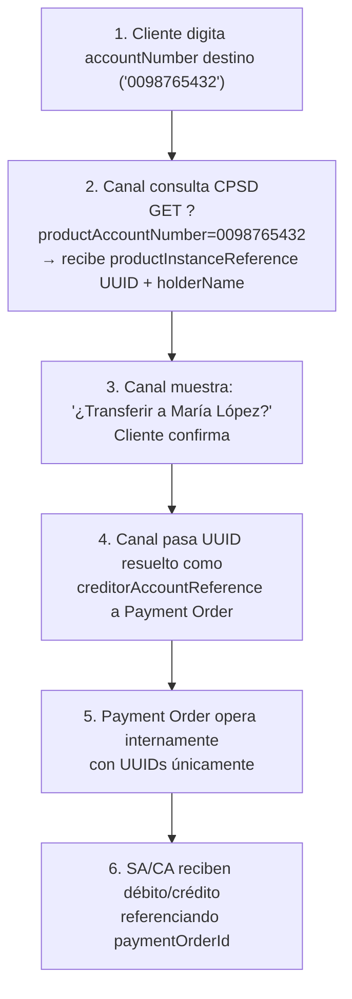

La resolución ocurre **en CPSD** con una sola llamada antes de invocar Payment Order. CPSD almacena el `productAccountNumber` porque SA y CA lo incluyen en el `notify` al momento de la apertura de cuenta.

---

## 9. Resolución de Account Number a UUID — Transferencias a Terceros

### El problema

El cliente ingresa manualmente un número de cuenta destino (ej: `0098765432`). Payment Order necesita el UUID de ese producto. La resolución depende de si la cuenta destino es del mismo banco o de otro banco.

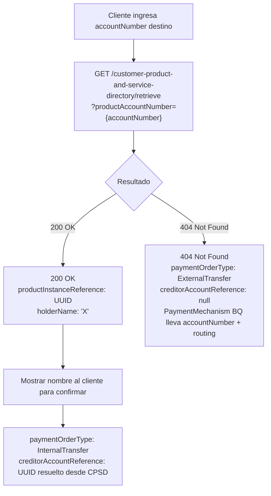

---

### 9.1 Resolución Intra-banco (misma entidad) — vía CPSD

**Enfoque recomendado:** CPSD es el único SD consultado para resolver `accountNumber → UUID`. Funciona porque al abrir cada cuenta SA o CA, el SD notifica a CPSD incluyendo el `productAccountNumber`, quedando indexado en el directorio.

#### APIs de resolución

```
# Paso 1: Resolver accountNumber en CPSD (una sola llamada, cubre SA y CA)
# [Extensión al estándar BIAN — query param no definido en el spec base]
GET    /customer-product-and-service-directory/retrieve
       ?productAccountNumber=0098765432
       Response: {
         "customerProductAndServiceDirectoryEntryId": "c9d0e1f2-...",
         "productInstanceReference": "9c7e6b5a-4d3f-2e1d-0c9b-8a7f6e5d4c3b",
         "productAccountNumber": "0098765432",
         "productAccountHolderName": "María López",
         "bankingProductTypeReference": "CUR-001",
         "productServiceStatus": "Active"
       }

# Paso 2: Con el UUID resuelto, iniciar Payment Order
POST   /payment-order/initiate
       Body: {
         "paymentOrderType": "InternalTransfer",
         "customerReference": "a1b2c3d4-e5f6-7890-abcd-ef1234567890",
         "debtorAccountReference": "e2f3a4b5-c6d7-8e9f-0a1b-2c3d4e5f6a7b",
         "creditorAccountReference": "9c7e6b5a-4d3f-2e1d-0c9b-8a7f6e5d4c3b",
         "paymentAmount": { "amount": 300.00, "currency": "USD" },
         "paymentDescription": "Pago a María López"
       }
```

> **Confirmación al cliente:** El `productAccountHolderName` devuelto por CPSD se muestra en pantalla — "¿Transferir a **María López**?" — antes de ejecutar.

#### Por qué CPSD y no SA/CA directamente

| Criterio | Buscar en SA + CA | Buscar en CPSD |
|---|---|---|
| Llamadas necesarias | 2 (secuencial, SA primero, CA si falla) | 1 |
| SDs expuestos a búsqueda | 2 | 1 |
| Cubre todos los tipos de cuenta | Solo SA y CA | SA, CA y cualquier producto futuro |
| Alineación con BIAN | Extensión custom en SD de producto | Extensión en el SD de directorio (más natural) |
| Punto único de verdad | No | Sí |

#### Lógica de resolución en la capa de integración

```
función resolverAccountNumber(accountNumber):
  resultado = GET /customer-product-and-service-directory/retrieve
                  ?productAccountNumber={accountNumber}

  si no resultado.encontrado:          // 404
    retornar { tipo: "externo" }       // el canal decide usar ExternalTransfer

  si resultado.productServiceStatus != "Active":
    lanzar error "Cuenta destino inactiva o cancelada"

  retornar {
    uuid:   resultado.productInstanceReference,
    tipo:   resultado.bankingProductTypeReference,
    nombre: resultado.productAccountHolderName
  }
```

---

### 9.2 Resolución Inter-banco (banco externo)

Para transferencias a cuentas de otros bancos, **no existe UUID interno**. El `accountNumber` (o IBAN) viaja como dato dentro del BQ `PaymentMechanism` de Payment Order. No se hace resolución previa.

```
# Paso 1: Iniciar Payment Order sin creditorAccountReference
POST   /payment-order/initiate
       Body: {
         "paymentOrderType": "ExternalTransfer",
         "customerReference": "a1b2c3d4-e5f6-7890-abcd-ef1234567890",
         "debtorAccountReference": "9c7e6b5a-4d3f-2e1d-0c9b-8a7f6e5d4c3b",
         "creditorAccountReference": null,
         "paymentAmount": { "amount": 500.00, "currency": "USD" },
         "paymentDescription": "Transferencia a tercero externo"
       }
       Response: {
         "paymentOrderId": "f5a6b7c8-d9e0-1f2a-3b4c-5d6e7f8a9b0c",
         "paymentOrderStatus": "PendingBeneficiaryDetails"
       }

# Paso 2: Agregar datos del beneficiario externo en PaymentMechanism BQ
PUT    /payment-order/f5a6b7c8-d9e0-1f2a-3b4c-5d6e7f8a9b0c/payment-mechanism/{bq-id}/update
       Body: {
         "paymentMechanismType": "LocalTransfer",
         "creditorAccountNumber": "0098765432",
         "creditorBankRoutingNumber": "021000021",
         "creditorAccountName": "Carlos Pérez",
         "creditorBankName": "Banco Externo SA"
       }

# Para transferencias SWIFT/internacionales:
PUT    /payment-order/f5a6b7c8-d9e0-1f2a-3b4c-5d6e7f8a9b0c/payment-mechanism/{bq-id}/update
       Body: {
         "paymentMechanismType": "SWIFT",
         "creditorIBAN": "ES9121000418450200051332",
         "creditorBIC": "CAIXESBBXXX",
         "creditorAccountName": "Carlos Pérez",
         "creditorBankName": "CaixaBank"
       }

# Paso 3: Confirmar y ejecutar
PUT    /payment-order/f5a6b7c8-d9e0-1f2a-3b4c-5d6e7f8a9b0c/order-confirmation/{bq-id}/update
       Body: { "customerConfirmationIndicator": true }
```

---

### 9.3 Beneficiarios Frecuentes (Terceros Guardados)

En BIAN 13, la gestión de beneficiarios frecuentes se modela como un BQ dentro del SD **Customer Workbench** o como datos almacenados en **Party Reference Data**. La práctica más común es mantener un registro propio en la capa de aplicación que el canal gestiona.

#### Flujo con beneficiario guardado

```
# Guardar beneficiario tras una transferencia exitosa
POST   /customer-workbench/{session-id}/third-party-access/{bq-id}/initiate
       Body: {
         "beneficiaryAlias": "María López - Ahorros",
         "beneficiaryAccountNumber": "0098765432",
         "beneficiaryAccountType": "InternalSA",
         "beneficiaryAccountUUID": "3fa85f64-5717-4562-b3fc-2c963f66afa6",
         "beneficiaryBankName": null
       }

# Listar beneficiarios guardados del cliente
GET    /customer-workbench/{session-id}/third-party-access/retrieve
       Response: [
         {
           "beneficiaryAlias": "María López - Ahorros",
           "beneficiaryAccountNumber": "0098765432",
           "beneficiaryAccountUUID": "3fa85f64-...",
           "beneficiaryType": "InternalSA"
         },
         {
           "beneficiaryAlias": "Carlos Pérez - Banco Externo",
           "beneficiaryAccountNumber": "1234567890",
           "creditorBankRoutingNumber": "021000021",
           "beneficiaryType": "External",
           "beneficiaryAccountUUID": null
         }
       ]
```

> Cuando el cliente selecciona un beneficiario guardado de tipo `InternalSA` o `InternalCA`, el UUID ya está disponible y el paso de resolución se omite. Solo los beneficiarios externos requieren usar el BQ `PaymentMechanism`.

---

### 9.4 Resolución de PAN de Tarjeta como Destino

#### El problema y la restricción PCI-DSS

Cuando el cliente ingresa un número de tarjeta (PAN de 16 dígitos) como destino, aplica una restricción **diferente y más severa** que con el `accountNumber`:

> **El PAN nunca puede viajar a través de APIs BIAN.** A diferencia del `accountNumber`, el PAN es dato de portador de tarjeta (CHD — Cardholder Data) bajo el alcance de PCI-DSS. Cualquier sistema que lo procese, almacene o transmita queda bajo auditoría PCI. La resolución debe ocurrir en una capa PCI-compliant **antes** de que el dato llegue a cualquier SD BIAN.

#### Árbol de decisión para PAN como destino

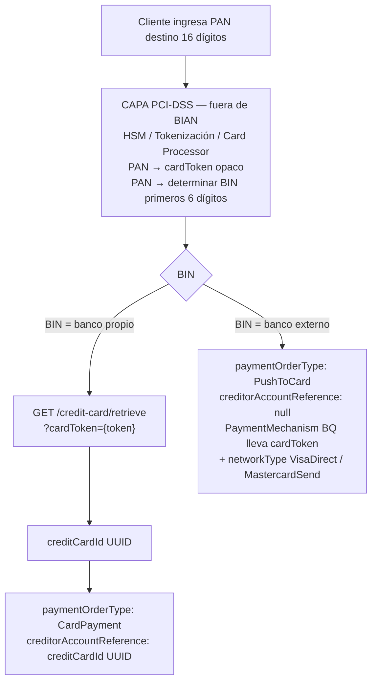

#### Por qué CPSD no puede resolver el PAN

A diferencia del `accountNumber` (que sí se indexa en CPSD), el PAN **no se almacena en CPSD** por dos razones:

| Razón | Detalle |
|---|---|
| **PCI-DSS scope** | Almacenar el PAN en CPSD incorporaría todo el directorio al alcance PCI, lo que exige controles de seguridad muy costosos sobre un SD que no los necesita |
| **Cross-customer privacy** | CPSD indexa productos por `customerReference`. El PAN destino puede pertenecer a otro cliente — CPSD no está diseñado para búsquedas anónimas cross-cliente |

La resolución pasa por el **Credit Card SD con extensión por cardToken**, que ya está dentro del perímetro PCI del banco.

---

#### 9.4.1 Caso A — PAN de tarjeta del mismo banco (intra-banco)

```
# Paso 1: El canal recibe el PAN del cliente y lo envía al HSM/tokenizador
# [FUERA DE BIAN — capa PCI]
POST   /tokenization-service/tokenize          (servicio interno PCI)
       Body: { "pan": "4532015112830366" }
       Response: {
         "cardToken": "tok_4Bc9XfZ2mRqL8nP1",
         "binCountry": "local",
         "issuingBank": "este-banco"
       }

# Paso 2: Con el cardToken, resolver el creditCardId en el Credit Card SD
# [Extensión al estándar BIAN — query param no definido en el spec base]
GET    /credit-card/retrieve
       ?cardToken=tok_4Bc9XfZ2mRqL8nP1
       Response: {
         "creditCardId": "e2f3a4b5-c6d7-8e9f-0a1b-2c3d4e5f6a7b",
         "cardNumberMasked": "****0366",
         "cardHolderName": "Ana Torres",
         "cardStatus": "Active"
       }

# Paso 3: Confirmar con el cliente el nombre del titular
# "¿Pagar a Ana Torres (****0366)?"

# Paso 4: Iniciar Payment Order con el creditCardId resuelto
POST   /payment-order/initiate
       Body: {
         "paymentOrderType": "CardPayment",
         "customerReference": "a1b2c3d4-e5f6-7890-abcd-ef1234567890",
         "debtorAccountReference": "9c7e6b5a-4d3f-2e1d-0c9b-8a7f6e5d4c3b",
         "creditorAccountReference": "e2f3a4b5-c6d7-8e9f-0a1b-2c3d4e5f6a7b",
         "paymentAmount": { "amount": 200.00, "currency": "USD" },
         "paymentDescription": "Pago a tarjeta ****0366"
       }
```

---

#### 9.4.2 Caso B — PAN de tarjeta de otro banco (Push to Card)

Para tarjetas externas se usa un nuevo `paymentOrderType: "PushToCard"` que dirige el pago a través de la red de tarjetas (Visa Direct / Mastercard Send). El `creditorAccountReference` es `null` — el destino se especifica en el BQ `PaymentMechanism` con el `cardToken`, nunca con el PAN.

```
# Paso 1: Tokenizar PAN en HSM (fuera de BIAN)
POST   /tokenization-service/tokenize
       Body: { "pan": "5412750000000000" }
       Response: {
         "cardToken": "tok_ext_9Kz3YxN7pQmR2sL5",
         "binCountry": "external",
         "networkType": "Mastercard",
         "issuingBank": "banco-externo"
       }

# Paso 2: Iniciar Payment Order tipo PushToCard
POST   /payment-order/initiate
       Body: {
         "paymentOrderType": "PushToCard",
         "customerReference": "a1b2c3d4-e5f6-7890-abcd-ef1234567890",
         "debtorAccountReference": "9c7e6b5a-4d3f-2e1d-0c9b-8a7f6e5d4c3b",
         "creditorAccountReference": null,
         "paymentAmount": { "amount": 150.00, "currency": "USD" },
         "paymentDescription": "Envío a tarjeta externa"
       }
       Response: {
         "paymentOrderId": "g6h7i8j9-k0l1-2m3n-4o5p-6q7r8s9t0u1v",
         "paymentOrderStatus": "PendingCardDetails"
       }

# Paso 3: Agregar datos de la tarjeta destino en PaymentMechanism BQ
PUT    /payment-order/g6h7i8j9-k0l1-2m3n-4o5p-6q7r8s9t0u1v/payment-mechanism/{bq-id}/update
       Body: {
         "paymentMechanismType": "MastercardSend",
         "creditorCardToken": "tok_ext_9Kz3YxN7pQmR2sL5",
         "creditorCardNetworkType": "Mastercard",
         "creditorCardHolderName": "Roberto Díaz",
         "creditorCardMasked": "****0000"
       }

# Para Visa Direct:
PUT    /payment-order/g6h7i8j9-k0l1-2m3n-4o5p-6q7r8s9t0u1v/payment-mechanism/{bq-id}/update
       Body: {
         "paymentMechanismType": "VisaDirect",
         "creditorCardToken": "tok_ext_2Wv4XuO8qPnS3tM6",
         "creditorCardNetworkType": "Visa",
         "creditorCardHolderName": "Roberto Díaz",
         "creditorCardMasked": "****1234"
       }

# Paso 4: Confirmar y enviar a la red de tarjetas
PUT    /payment-order/g6h7i8j9-k0l1-2m3n-4o5p-6q7r8s9t0u1v/order-confirmation/{bq-id}/update
       Body: { "customerConfirmationIndicator": true }
```

---

#### Lógica completa de resolución cuando el cliente ingresa un PAN

```
función resolverPAN(pan):
  // Paso 1 — Fuera de BIAN, en capa PCI
  resultado = POST /tokenization-service/tokenize { pan }
  cardToken  = resultado.cardToken
  isInternal = resultado.issuingBank == "este-banco"

  // Paso 2 — Dentro de BIAN
  si isInternal:
    tarjeta = GET /credit-card/retrieve?cardToken={cardToken}

    si no tarjeta.encontrada:
      lanzar error "Tarjeta no encontrada"

    si tarjeta.cardStatus != "Active":
      lanzar error "Tarjeta destino inactiva o cancelada"

    retornar {
      tipo:   "CardPayment",
      uuid:   tarjeta.creditCardId,
      nombre: tarjeta.cardHolderName,
      masked: tarjeta.cardNumberMasked
    }

  sino:  // tarjeta externa
    retornar {
      tipo:      "PushToCard",
      uuid:      null,
      cardToken: cardToken,
      network:   resultado.networkType   // "Visa" | "Mastercard"
    }
```

---

### 9.5 Tabla de escenarios: qué viaja en cada campo de Payment Order

| Escenario de entrada | `paymentOrderType` | `creditorAccountReference` | `PaymentMechanism BQ` |
|---|---|---|---|
| accountNumber intra-banco (SA/CA propia) | `InternalTransfer` | UUID de CPSD | No requerido |
| accountNumber intra-banco (tercero) | `InternalTransfer` | UUID de CPSD | No requerido |
| accountNumber externo (ACH / SWIFT) | `ExternalTransfer` | `null` | `accountNumber` + routing / IBAN + BIC |
| PAN intra-banco (CC del mismo banco) | `CardPayment` | `creditCardId` UUID de CC retrieve | No requerido |
| PAN externo (Visa Direct) | `PushToCard` | `null` | `cardToken` + `VisaDirect` |
| PAN externo (Mastercard Send) | `PushToCard` | `null` | `cardToken` + `MastercardSend` |
| Beneficiario guardado intra-banco | `InternalTransfer` | UUID almacenado | No requerido |
| Pago de tarjeta propia (CC del cliente) | `CardPayment` | `creditCardId` UUID | No requerido |

---

### Cuándo usar Payment Order vs BQ directo en SA/CA

| Escenario | SD recomendado |
|---|---|
| Transferencia entre cuentas (mismo o diferente banco) | Payment Order |
| Transferencia a tercero con cuenta digitada | Payment Order + resolución via CPSD |
| PAN intra-banco como destino | Tokenizar → CC retrieve → Payment Order `CardPayment` |
| PAN externo como destino | Tokenizar → Payment Order `PushToCard` + PaymentMechanism BQ |
| Pago de tarjeta propia desde canal digital | Payment Order (`CardPayment`) |
| Pago automático/domiciliado de tarjeta | CC Repayment BQ directamente |
| Débito/crédito interno del banco (interés, comisión) | SA/CA BQ (Interest, ServiceFees) |
| Retiro en ATM con débito inmediato | DC Authorization BQ → SA/CA Payments BQ |
