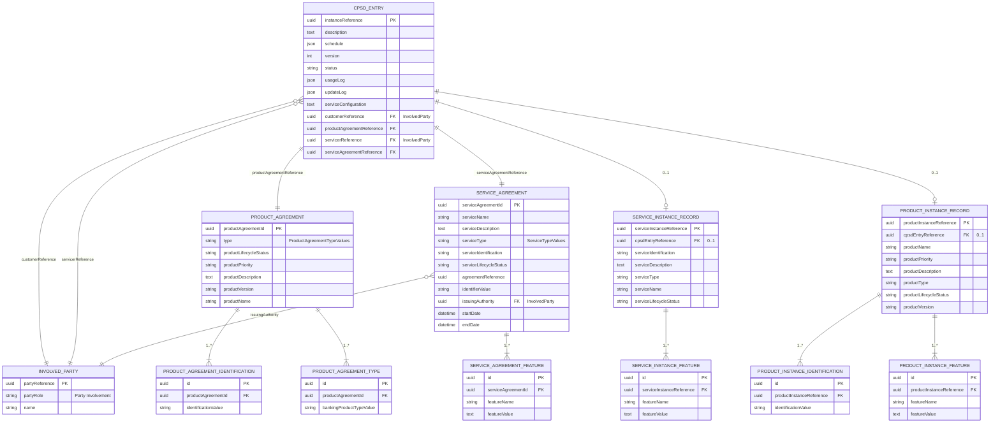

# CPSD — Modelo de Base de Datos según BIAN (Service Landscape 13.0.0)

Modelo de datos derivado directamente del Data Model oficial de BIAN para el
Service Domain **Customer Product and Service Directory**, vista:
https://bian.org/servicelandscape-13-0-0/views/view_47556.html

A diferencia de [cpsd-modelo-datos.md](cpsd-modelo-datos.md) (modelo simplificado
orientado a ejemplos de integración con SA/CA/CC/DC), este documento respeta
los nombres de atributo, datatypes y cardinalidades exactos publicados por BIAN:
Control Record, Product Agreement, Service Agreement y los dos Behavior
Qualifiers (Service Instance Record / Product Instance Record).

---

## 1. Elementos del Data Model BIAN (verbatim)

### Control Record (CR) — Customer Product And Service Directory Entry Instance Record

| Atributo | Datatype |
|---|---|
| Description | Text |
| Schedule | Schedule |
| Version | Number |
| Status | Status |
| Usage Log | Log |
| Update Log | Log |
| Service Configuration | Text |
| Instance Reference | Identifier |
| Customer Reference | InvolvedParty |
| Product Agreement Reference | Product Agreement |
| Servicer Reference | InvolvedParty |
| Service Agreement Reference | Service Agreement |

### Product Agreement (estructura anidada)

| Atributo | Datatype | Cardinalidad |
|---|---|---|
| Type | ProductAgreementTypeValues | |
| Product Identification | ProductIdentification | 1..* |
| Product Type | BankingProductTypeValues | 1..* |
| Product Lifecycle Status | ProductStatus | |
| Product Priority | Text | |
| Product Description | Text | |
| Product Version | Text | |
| Product Name | Name | |

### Service Agreement (estructura anidada)

| Atributo | Datatype | Cardinalidad |
|---|---|---|
| Service Name | Name | |
| Service Description | Text | |
| Service Type | ServiceTypeValues | |
| Service Identification | Identifier | |
| Service Lifecycle Status | Status | |
| Service Feature | Feature | 1..* |
| Agreement Reference | Agreement | |
| Identifier Value | Value | |
| Issuing Authority | InvolvedParty | |
| Start Date | DateTime | |
| End Date | DateTime | |

### Behavior Qualifiers (BQ)

**Service Instance Record** (0..1 dentro del CR)

| Atributo | Datatype | Cardinalidad |
|---|---|---|
| Service Instance Reference | Identifier | |
| Service Identification | Identifier | |
| Service Description | Text | |
| Service Type | ServiceTypeValues | |
| Service Name | Name | |
| Service Lifecycle Status | Status | |
| Service Feature | Feature | 1..* |

**Product Instance Record** (0..1 dentro del CR)

| Atributo | Datatype | Cardinalidad |
|---|---|---|
| Product Instance Reference | Identifier | |
| Product Identification | ProductIdentification | 1..* |
| Product Name | Name | |
| Product Priority | Text | |
| Product Description | Text | |
| Product Type | BankingProductTypeValues | |
| Product Lifecycle Status | ProductStatus | |
| Product Version | Text | |
| Product Feature | Product Feature | 1..* |

### Party Reference

- `Party Involvement` → `Party Role`
- `InvolvedParty` (datatype usado por Customer Reference y Servicer Reference)

---

## 2. Modelo Entidad-Relación

Normalización: el CR es la entidad central; Product Agreement y Service
Agreement son entidades 1:1 referenciadas por el CR; las listas con
cardinalidad `1..*` (Product Identification, Product Type, Service Feature,
Product Feature) se modelan como tablas hijas; los dos BQ son tablas 0..1
dependientes del CR (relación de extensión, no de catálogo).



---

## 3. DDL de referencia (PostgreSQL)

### 3.1 Enums (Value Lists de BIAN)

Los `*Values` y `*Status` del modelo BIAN son listas de valores controladas;
se mapean a `ENUM` en lugar de `TEXT` para que el motor rechace valores
inválidos en el `INSERT`, no en la capa de aplicación.

```sql
CREATE TYPE cpsd_status AS ENUM ('Active', 'Suspended', 'Closed', 'Pending');
CREATE TYPE product_status AS ENUM ('Active', 'Inactive', 'Pending', 'Closed');
CREATE TYPE service_lifecycle_status AS ENUM ('Active', 'Inactive', 'Pending', 'Closed');
CREATE TYPE product_agreement_type_values AS ENUM ('Primary', 'Secondary', 'Linked');
CREATE TYPE service_type_values AS ENUM ('Core', 'ValueAdded', 'ThirdParty');
CREATE TYPE party_role_values AS ENUM ('Customer', 'Servicer', 'IssuingAuthority');
```

### 3.2 Tablas

```sql
CREATE TABLE involved_party (
    party_reference UUID PRIMARY KEY,
    party_role      party_role_values NOT NULL,   -- Party Involvement
    name            VARCHAR(140) NOT NULL
);

CREATE TABLE product_agreement (
    product_agreement_id     UUID PRIMARY KEY,
    type                      product_agreement_type_values NOT NULL,
    product_lifecycle_status product_status NOT NULL DEFAULT 'Pending',
    product_priority         SMALLINT CHECK (product_priority BETWEEN 1 AND 5),
    product_description      VARCHAR(500),
    product_version          VARCHAR(20),
    product_name             VARCHAR(140) NOT NULL
);

CREATE TABLE product_agreement_identification (
    id                    UUID PRIMARY KEY,
    product_agreement_id UUID NOT NULL REFERENCES product_agreement(product_agreement_id) ON DELETE CASCADE,
    identification_value  VARCHAR(64) NOT NULL,
    UNIQUE (product_agreement_id, identification_value)
);

CREATE TABLE product_agreement_type (
    id                          UUID PRIMARY KEY,
    product_agreement_id       UUID NOT NULL REFERENCES product_agreement(product_agreement_id) ON DELETE CASCADE,
    banking_product_type_value VARCHAR(64) NOT NULL,  -- BankingProductTypeValues
    UNIQUE (product_agreement_id, banking_product_type_value)
);

CREATE TABLE service_agreement (
    service_agreement_id     UUID PRIMARY KEY,
    service_name              VARCHAR(140) NOT NULL,
    service_description       VARCHAR(500),
    service_type               service_type_values NOT NULL,
    service_identification     VARCHAR(64) NOT NULL,
    service_lifecycle_status   service_lifecycle_status NOT NULL DEFAULT 'Pending',
    agreement_reference        UUID,
    identifier_value           VARCHAR(64),
    issuing_authority          UUID REFERENCES involved_party(party_reference),
    start_date                  TIMESTAMPTZ NOT NULL,
    end_date                    TIMESTAMPTZ,
    CONSTRAINT service_agreement_valid_period CHECK (end_date IS NULL OR end_date > start_date)
);

CREATE TABLE service_agreement_feature (
    id                    UUID PRIMARY KEY,
    service_agreement_id UUID NOT NULL REFERENCES service_agreement(service_agreement_id) ON DELETE CASCADE,
    feature_name          VARCHAR(100) NOT NULL,
    feature_value         VARCHAR(500),
    UNIQUE (service_agreement_id, feature_name)
);

CREATE TABLE cpsd_entry (
    instance_reference          UUID PRIMARY KEY,   -- Instance Reference
    description                  VARCHAR(500),
    schedule                      JSONB,
    version                        INTEGER NOT NULL DEFAULT 1 CHECK (version > 0),
    status                         cpsd_status NOT NULL DEFAULT 'Pending',
    usage_log                      JSONB NOT NULL DEFAULT '[]',
    update_log                     JSONB NOT NULL DEFAULT '[]',
    service_configuration          VARCHAR(500),
    customer_reference             UUID NOT NULL REFERENCES involved_party(party_reference),
    product_agreement_reference    UUID NOT NULL UNIQUE REFERENCES product_agreement(product_agreement_id),
    servicer_reference              UUID REFERENCES involved_party(party_reference),
    service_agreement_reference     UUID NOT NULL UNIQUE REFERENCES service_agreement(service_agreement_id),
    CONSTRAINT cpsd_entry_distinct_parties CHECK (servicer_reference IS NULL OR servicer_reference <> customer_reference)
);

-- Behavior Qualifier: Service Instance Record (0..1 por CR)
CREATE TABLE service_instance_record (
    service_instance_reference UUID PRIMARY KEY,
    cpsd_entry_reference        UUID NOT NULL UNIQUE REFERENCES cpsd_entry(instance_reference) ON DELETE CASCADE,
    service_identification       VARCHAR(64) NOT NULL,
    service_description           VARCHAR(500),
    service_type                   service_type_values NOT NULL,
    service_name                   VARCHAR(140) NOT NULL,
    service_lifecycle_status       service_lifecycle_status NOT NULL DEFAULT 'Pending'
);

CREATE TABLE service_instance_feature (
    id                            UUID PRIMARY KEY,
    service_instance_reference   UUID NOT NULL REFERENCES service_instance_record(service_instance_reference) ON DELETE CASCADE,
    feature_name                  VARCHAR(100) NOT NULL,
    feature_value                  VARCHAR(500),
    UNIQUE (service_instance_reference, feature_name)
);

-- Behavior Qualifier: Product Instance Record (0..1 por CR)
CREATE TABLE product_instance_record (
    product_instance_reference UUID PRIMARY KEY,
    cpsd_entry_reference        UUID NOT NULL UNIQUE REFERENCES cpsd_entry(instance_reference) ON DELETE CASCADE,
    product_name                 VARCHAR(140) NOT NULL,
    product_priority              SMALLINT CHECK (product_priority BETWEEN 1 AND 5),
    product_description            VARCHAR(500),
    product_type                   VARCHAR(64) NOT NULL,   -- BankingProductTypeValues
    product_lifecycle_status       product_status NOT NULL DEFAULT 'Pending',
    product_version                VARCHAR(20)
);

CREATE TABLE product_instance_identification (
    id                            UUID PRIMARY KEY,
    product_instance_reference   UUID NOT NULL REFERENCES product_instance_record(product_instance_reference) ON DELETE CASCADE,
    identification_value          VARCHAR(64) NOT NULL,
    UNIQUE (product_instance_reference, identification_value)
);

CREATE TABLE product_instance_feature (
    id                            UUID PRIMARY KEY,
    product_instance_reference   UUID NOT NULL REFERENCES product_instance_record(product_instance_reference) ON DELETE CASCADE,
    feature_name                   VARCHAR(100) NOT NULL,
    feature_value                   VARCHAR(500),
    UNIQUE (product_instance_reference, feature_name)
);
```

### 3.3 Índices

Los `UNIQUE` y `PRIMARY KEY` arriba ya crean índice implícito. Estos son los
adicionales para los patrones de consulta esperados sobre CPSD (lookup por
cliente, por servicer, por estado, y búsquedas dentro de los logs JSONB):

```sql
-- Lookup de todas las entradas CPSD de un cliente (la consulta más frecuente)
CREATE INDEX idx_cpsd_entry_customer_reference ON cpsd_entry (customer_reference);

-- Lookup por servicer (cuando el producto es administrado por un tercero)
CREATE INDEX idx_cpsd_entry_servicer_reference ON cpsd_entry (servicer_reference)
    WHERE servicer_reference IS NOT NULL;

-- Filtrado por estado (paneles operativos: cuántas entradas Active/Suspended/Closed)
CREATE INDEX idx_cpsd_entry_status ON cpsd_entry (status);

-- Combinación cliente + estado: "productos activos de un cliente"
CREATE INDEX idx_cpsd_entry_customer_status ON cpsd_entry (customer_reference, status);

-- Resolución inversa: encontrar el CPSD entry a partir de una identificación de producto
CREATE INDEX idx_product_agreement_identification_value ON product_agreement_identification (identification_value);

-- Resolución inversa: encontrar el CPSD entry a partir de una identificación de instancia de producto
CREATE INDEX idx_product_instance_identification_value ON product_instance_identification (identification_value);

-- Lookup de Service Agreement por tipo de servicio (catálogo de servicios activos)
CREATE INDEX idx_service_agreement_type_status ON service_agreement (service_type, service_lifecycle_status);

-- Búsqueda dentro de usage_log / update_log (auditoría) sin escanear toda la tabla
CREATE INDEX idx_cpsd_entry_usage_log_gin ON cpsd_entry USING GIN (usage_log);
CREATE INDEX idx_cpsd_entry_update_log_gin ON cpsd_entry USING GIN (update_log);
```

> Nota: `product_agreement_reference` y `service_agreement_reference` en
> `cpsd_entry` llevan `UNIQUE` porque el modelo BIAN define la relación CR →
> Product/Service Agreement como 1:1 (cada agreement pertenece a una sola
> entrada CPSD); sin ese `UNIQUE` el motor permitiría que dos `cpsd_entry`
> apuntaran al mismo agreement, rompiendo la cardinalidad real del modelo.

---

## 4. Notas de diseño

- `Product Agreement` y `Service Agreement` se modelan como tablas separadas
  en relación 1:1 con `cpsd_entry` porque BIAN las define como estructuras
  anidadas referenciadas (no como catálogos compartidos entre múltiples CR).
- Las listas con cardinalidad `1..*` del modelo BIAN (`Product Identification`,
  `Product Type`, `Service Feature`, `Product Feature`) requieren tablas hijas
  porque una columna relacional no puede representar una colección sin romper
  1FN; alternativamente pueden colapsarse en columnas `JSONB` si el motor de
  base de datos lo soporta y no se necesita indexar sobre esos valores.
- `Service Instance Record` y `Product Instance Record` son *Behavior
  Qualifiers*, es decir, extensiones opcionales (0..1) del Control Record, no
  catálogos: por eso llevan `UNIQUE` sobre la FK hacia `cpsd_entry`.
- Para el mapeo hacia el modelo simplificado de integración (SA/CA/CC/DC) ver
  [cpsd-modelo-datos.md](cpsd-modelo-datos.md): `Product Instance Reference`
  de este modelo equivale a `productInstanceReference` allí.
