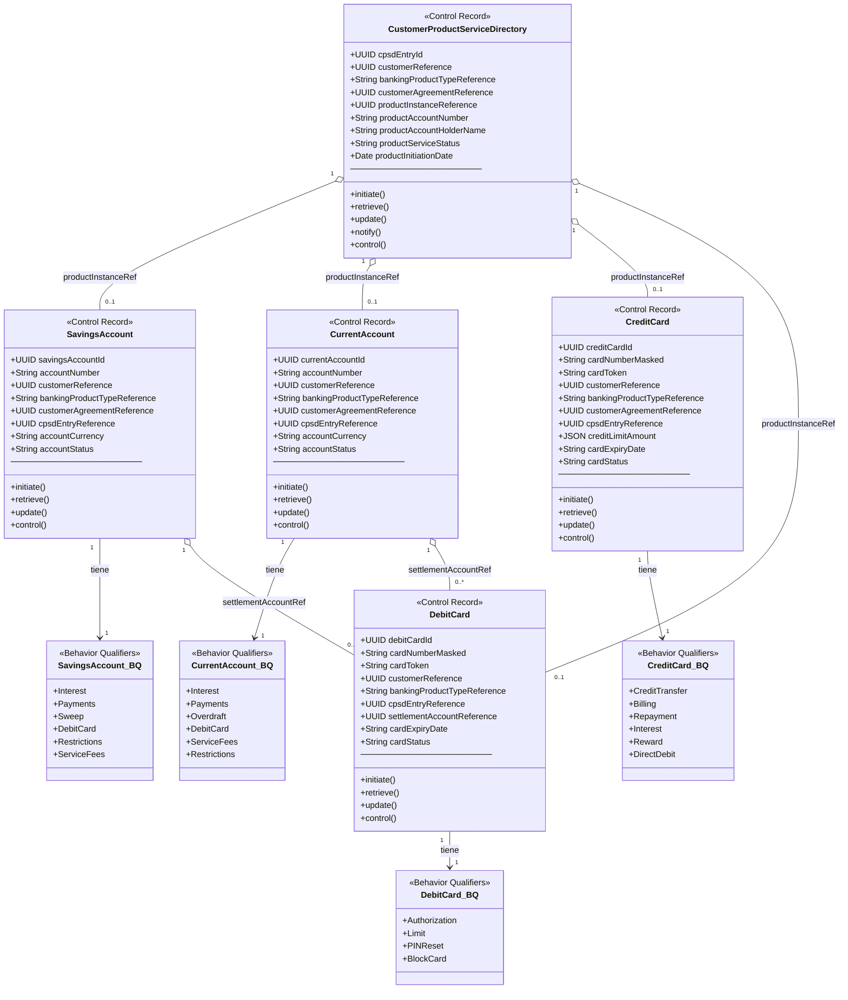
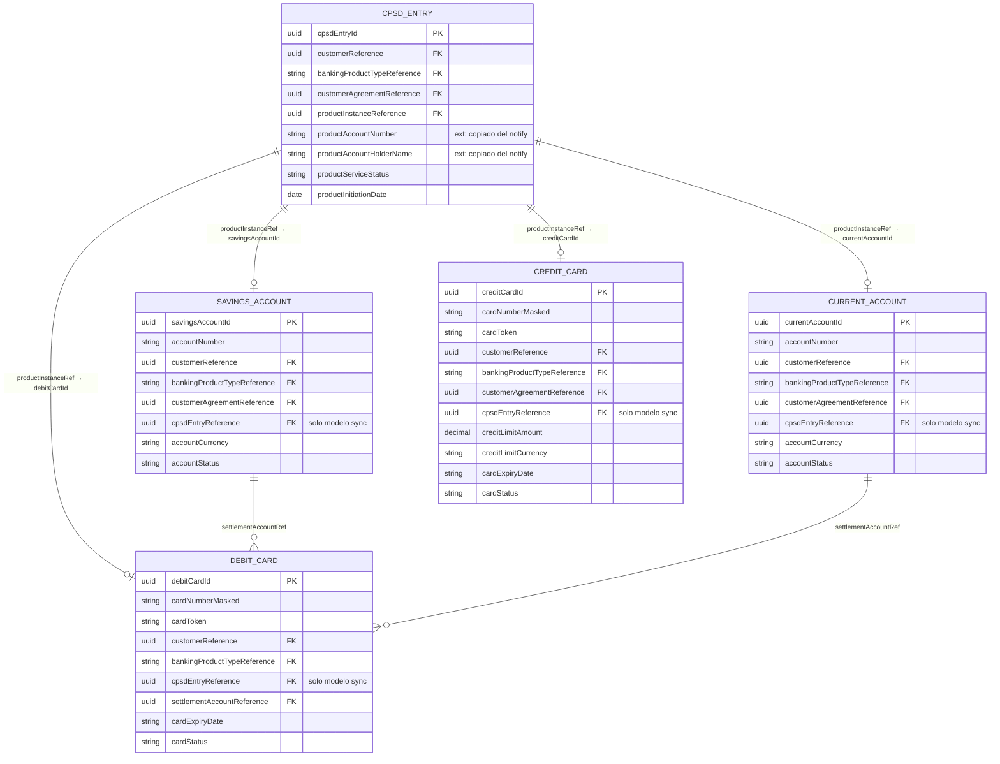
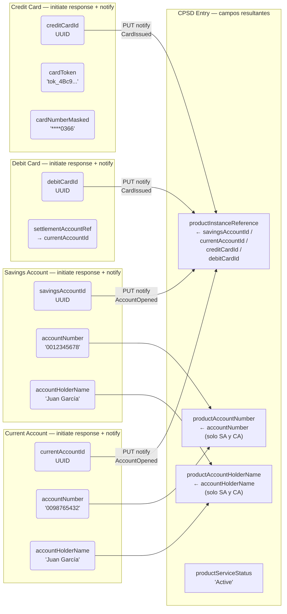
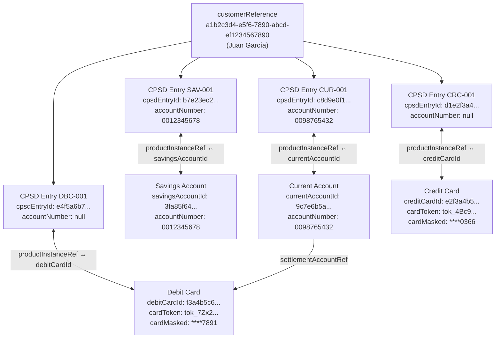

# CPSD — Modelo de Datos, Componentes y Ejemplos

Cómo los Service Domains de producto (SA, CA, CC, DC) alimentan el **Customer Product and Service Directory** en BIAN 13.

---

## 1. Diagrama de Componentes — Control Records y Behavior Qualifiers

Cada SD expone un Control Record (estado persistente) más un conjunto de BQs (operaciones sobre aspectos del CR).



---

## 2. Modelo de Datos — Relaciones entre Control Records



---

## 3. Flujo de Datos hacia CPSD — Qué campo alimenta qué



---

## 4. Datos de Ejemplo — Cliente Juan García

### 4.1 Entradas en CPSD

Resultado de una consulta `GET /customer-product-and-service-directory/retrieve?customerReference=a1b2c3d4-e5f6-7890-abcd-ef1234567890`:

| cpsdEntryId | bankingProductTypeRef | productInstanceRef | productAccountNumber | productAccountHolderName | productServiceStatus |
|---|---|---|---|---|---|
| `b7e23ec2-9cc0-4b27-a3f5-1d8a07cd8e2f` | `SAV-001` | `3fa85f64-5717-4562-b3fc-2c963f66afa6` | `0012345678` | Juan García | Active |
| `c8d9e0f1-a2b3-4c5d-6e7f-8a9b0c1d2e3f` | `CUR-001` | `9c7e6b5a-4d3f-2e1d-0c9b-8a7f6e5d4c3b` | `0098765432` | Juan García | Active |
| `d1e2f3a4-b5c6-7d8e-9f0a-1b2c3d4e5f6a` | `CRC-001` | `e2f3a4b5-c6d7-8e9f-0a1b-2c3d4e5f6a7b` | *(null)* | *(null)* | Active |
| `e4f5a6b7-c8d9-0e1f-2a3b-4c5d6e7f8a9b` | `DBC-001` | `f3a4b5c6-d7e8-9f0a-1b2c-3d4e5f6a7b8c` | *(null)* | *(null)* | Active |

> `productAccountNumber` solo se popula para SA y CA. Las tarjetas (CC y DC) no tienen número de cuenta bancario — se identifican por cardToken para operaciones y cardNumberMasked para display.

---

### 4.2 Control Record — Savings Account

| Campo | Valor |
|---|---|
| `savingsAccountId` | `3fa85f64-5717-4562-b3fc-2c963f66afa6` |
| `accountNumber` | `0012345678` |
| `customerReference` | `a1b2c3d4-e5f6-7890-abcd-ef1234567890` |
| `bankingProductTypeReference` | `SAV-001` |
| `customerAgreementReference` | `f47ac10b-58cc-4372-a567-0e02b2c3d479` |
| `customerProductAndServiceDirectoryEntryReference` | `b7e23ec2-9cc0-4b27-a3f5-1d8a07cd8e2f` |
| `accountCurrency` | `USD` |
| `accountStatus` | `Active` |

---

### 4.3 Control Record — Current Account

| Campo | Valor |
|---|---|
| `currentAccountId` | `9c7e6b5a-4d3f-2e1d-0c9b-8a7f6e5d4c3b` |
| `accountNumber` | `0098765432` |
| `customerReference` | `a1b2c3d4-e5f6-7890-abcd-ef1234567890` |
| `bankingProductTypeReference` | `CUR-001` |
| `customerAgreementReference` | `f47ac10b-58cc-4372-a567-0e02b2c3d479` |
| `customerProductAndServiceDirectoryEntryReference` | `c8d9e0f1-a2b3-4c5d-6e7f-8a9b0c1d2e3f` |
| `accountCurrency` | `USD` |
| `accountStatus` | `Active` |

---

### 4.4 Control Record — Credit Card

| Campo | Valor |
|---|---|
| `creditCardId` | `e2f3a4b5-c6d7-8e9f-0a1b-2c3d4e5f6a7b` |
| `cardNumberMasked` | `****0366` |
| `cardToken` | `tok_4Bc9XfZ2mRqL8nP1` |
| `customerReference` | `a1b2c3d4-e5f6-7890-abcd-ef1234567890` |
| `bankingProductTypeReference` | `CRC-001` |
| `customerAgreementReference` | `f47ac10b-58cc-4372-a567-0e02b2c3d479` |
| `customerProductAndServiceDirectoryEntryReference` | `d1e2f3a4-b5c6-7d8e-9f0a-1b2c3d4e5f6a` |
| `creditLimitAmount` | `{ "amount": 5000.00, "currency": "USD" }` |
| `cardExpiryDate` | `2027-01` |
| `cardStatus` | `Active` |

> CC no aporta `productAccountNumber` al CPSD porque las tarjetas de crédito no tienen número de cuenta bancario. El identificador de operaciones es el `cardToken`; el `cardNumberMasked` es solo para display.

---

### 4.5 Control Record — Debit Card

| Campo | Valor |
|---|---|
| `debitCardId` | `f3a4b5c6-d7e8-9f0a-1b2c-3d4e5f6a7b8c` |
| `cardNumberMasked` | `****7891` |
| `cardToken` | `tok_7Zx2YwQ9mNpR3sK6` |
| `customerReference` | `a1b2c3d4-e5f6-7890-abcd-ef1234567890` |
| `bankingProductTypeReference` | `DBC-001` |
| `customerProductAndServiceDirectoryEntryReference` | `e4f5a6b7-c8d9-0e1f-2a3b-4c5d6e7f8a9b` |
| `settlementAccountReference` | `9c7e6b5a-4d3f-2e1d-0c9b-8a7f6e5d4c3b` *(→ currentAccountId)* |
| `cardExpiryDate` | `2027-01` |
| `cardStatus` | `Active` |

> DC no tiene `customerAgreementReference` propio. Tampoco aporta `productAccountNumber` al CPSD. Su única referencia cruzada obligatoria a otro SD de producto es `settlementAccountReference`, que apunta a la CA (o SA) a la que está vinculada.

---

## 5. Trazabilidad cruzada — Todos los UUIDs del cliente Juan García



---

## 6. Tabla de Resolución — accountNumber → UUID (uso en transferencias)

Cuando el canal necesita enviar dinero a `0098765432`, consulta CPSD:

```
GET /customer-product-and-service-directory/retrieve?productAccountNumber=0098765432
```

| Paso | Campo consultado | Valor retornado | Uso |
|---|---|---|---|
| Input del cliente | `accountNumber` ingresado | `0098765432` | Texto que digita el usuario |
| Resultado CPSD | `productInstanceReference` | `9c7e6b5a-4d3f-2e1d-0c9b-8a7f6e5d4c3b` | UUID que va como `creditorAccountReference` en Payment Order |
| Resultado CPSD | `productAccountHolderName` | `Juan García` | Nombre que se muestra para confirmar al usuario |
| Resultado CPSD | `bankingProductTypeReference` | `CUR-001` | Confirma que es una cuenta corriente |
| Resultado CPSD | `productServiceStatus` | `Active` | Valida que la cuenta puede recibir fondos |

> Las tarjetas (`CRC-001`, `DBC-001`) no aparecen en este lookup porque no tienen `productAccountNumber`. Un PAN de tarjeta se resuelve por vía distinta: tokenización en HSM → `GET /credit-card/retrieve?cardToken=...`.
