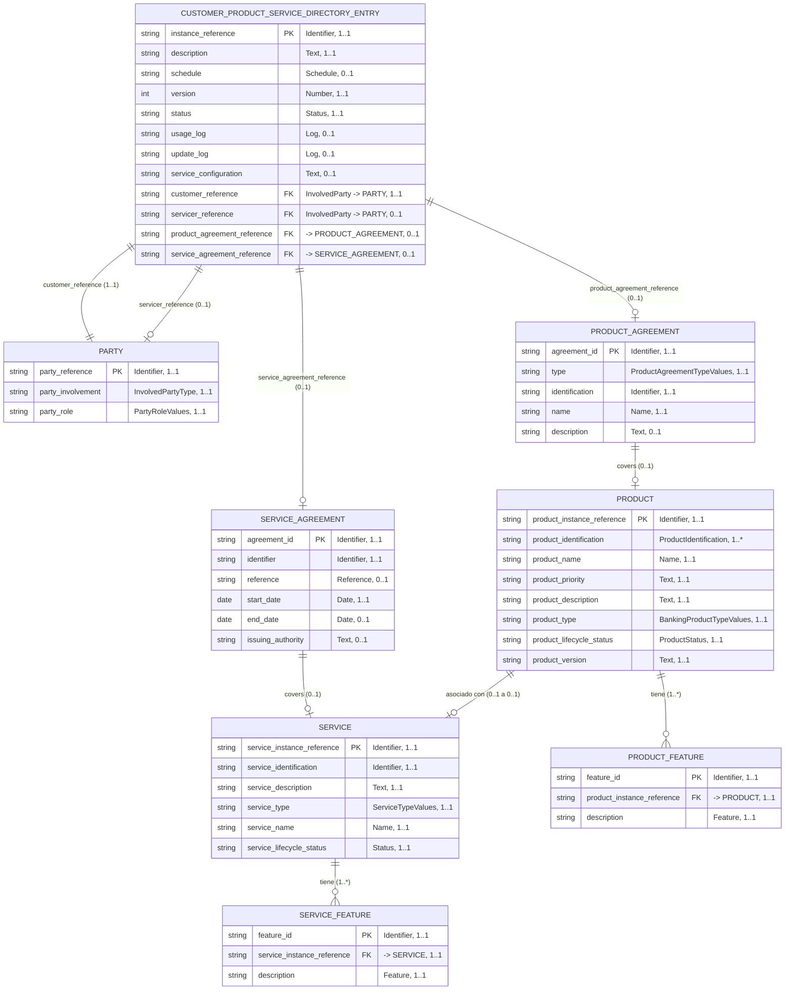

# Customer Product and Service Directory — Diagrama de Base de Datos

Fuente: [BIAN Service Landscape 13.0.0 — view_47556](https://bian.org/servicelandscape-13-0-0/views/view_47556.html)

Service Domain: **Customer Product and Service Directory**
Diagrama BIAN: Control Record (CR) Diagram, con sus Behavior Qualifiers (BQ) asociados.

## Modelo Entidad-Relación

## Identificadores: cómo se relacionan las entidades

BIAN no modela claves foráneas explícitas como un RDBMS tradicional; usa **referencias** (`Reference` / `Identifier`) dentro del Control Record que apuntan a las claves primarias de las entidades vinculadas. Para representarlo en un modelo relacional clásico, cada referencia del CR se trata como FK:

| Atributo en el CR | Tipo BIAN | Apunta a (PK) | Cardinalidad |
|---|---|---|---|
| `instance_reference` | Identifier | — (PK propia del CR) | 1..1 |
| `customer_reference` | InvolvedParty | `PARTY.party_reference` | 1..1 (obligatorio: todo directorio pertenece a un cliente) |
| `servicer_reference` | InvolvedParty | `PARTY.party_reference` | 0..1 (opcional: la unidad de negocio/servidor que administra el directorio) |
| `product_agreement_reference` | Reference | `PRODUCT_AGREEMENT.agreement_id` | 0..1 |
| `service_agreement_reference` | Reference | `SERVICE_AGREEMENT.agreement_id` | 0..1 |

Puntos clave sobre identificadores:
- **`PARTY` se reutiliza dos veces** desde el CR (como `customer_reference` y como `servicer_reference`), con roles distintos (`party_role`). No son dos tablas distintas, sino dos relaciones diferentes hacia la misma entidad `PARTY`.
- **`PRODUCT.product_instance_reference`** y **`SERVICE.service_instance_reference`** son identificadores propios de cada Behavior Qualifier (BQ); no dependen del CR directamente, sino que cuelgan de su respectivo `*_AGREEMENT`.
- **`PRODUCT_FEATURE`** y **`SERVICE_FEATURE`** son entidades débiles: su PK (`feature_id`) solo tiene sentido en combinación con la FK hacia su entidad padre (`product_instance_reference` / `service_instance_reference`).
- La relación `PRODUCT` ↔ `SERVICE` (0..1 a 0..1) **no tiene un atributo de referencia explícito** en el modelo BIAN original; se infiere porque ambos BQ pueden coexistir bajo el mismo `CUSTOMER_PRODUCT_SERVICE_DIRECTORY_ENTRY` y BIAN permite enlazarlos cuando un producto trae un servicio incluido (p. ej. una cuenta con banca móvil asociada).

## Descripción de Entidades

### CUSTOMER_PRODUCT_SERVICE_DIRECTORY_ENTRY (Control Record)
Entidad central del Service Domain. Es el "índice maestro" de todos los productos y servicios que un cliente tiene contratados con el banco.

| Atributo | Tipo de dato | Cardinalidad | Descripción |
|---|---|---|---|
| Instance Reference (PK) | Identifier | 1..1 | Identificador único de la entrada del directorio. |
| Description | Text | 1..1 | Descripción libre de la entrada. |
| Schedule | Schedule | 0..1 | Calendario/cronograma asociado (p. ej. fechas de revisión). |
| Version | Number | 1..1 | Número de versión del registro. |
| Status | Status | 1..1 | Estado del ciclo de vida de la entrada (activo, cerrado, etc.). |
| Usage Log | Log | 0..1 | Bitácora de uso del directorio. |
| Update Log | Log | 0..1 | Bitácora de actualizaciones/cambios. |
| Service Configuration | Text | 0..1 | Configuración específica de cómo se presta el servicio. |
| Customer Reference (FK) | InvolvedParty | 1..1 | Referencia al cliente (`PARTY`) propietario del directorio. |
| Servicer Reference (FK) | InvolvedParty | 0..1 | Referencia a la parte que administra/sirve el directorio (`PARTY`). |
| Product Agreement Reference (FK) | Reference | 0..1 | Acuerdo de producto vinculado. |
| Service Agreement Reference (FK) | Reference | 0..1 | Acuerdo de servicio vinculado. |

### PARTY
Representa a cualquier parte involucrada en la entrada del directorio (cliente o servidor). Se vincula dos veces desde el CR, una por cada rol.

| Atributo | Tipo de dato | Cardinalidad | Descripción |
|---|---|---|---|
| Party Reference (PK) | Identifier | 1..1 | Identificador único de la parte. |
| Party Involvement | InvolvedPartyType | 1..1 | Tipo de involucramiento (cliente, servidor, etc.). |
| Party Role | PartyRoleValues | 1..1 | Rol concreto que juega la parte en esta relación. |

### PRODUCT_AGREEMENT
Acuerdo de producto suscrito por el cliente; es el contrato bajo el cual existe la instancia de `PRODUCT`.

| Atributo | Tipo de dato | Cardinalidad | Descripción |
|---|---|---|---|
| Agreement ID (PK) | Identifier | 1..1 | Identificador único del acuerdo. |
| Type | ProductAgreementTypeValues | 1..1 | Tipo de acuerdo (lista de valores controlada por BIAN). |
| Identification | Identifier | 1..1 | Identificación adicional/externa del acuerdo. |
| Name | Name | 1..1 | Nombre del acuerdo. |
| Description | Text | 0..1 | Descripción del acuerdo. |

### SERVICE_AGREEMENT
Acuerdo de servicio asociado; contrato bajo el cual existe la instancia de `SERVICE`.

| Atributo | Tipo de dato | Cardinalidad | Descripción |
|---|---|---|---|
| Agreement ID (PK) | Identifier | 1..1 | Identificador único del acuerdo. |
| Identifier | Identifier | 1..1 | Identificador del acuerdo de servicio. |
| Reference | Reference | 0..1 | Referencia externa/cruzada. |
| Start Date | Date | 1..1 | Fecha de inicio de vigencia. |
| End Date | Date | 0..1 | Fecha de fin de vigencia (si aplica). |
| Issuing Authority | Text | 0..1 | Autoridad que emite o regula el acuerdo. |

### PRODUCT (Behavior Qualifier — Product Instance Record)
Instancia de producto bancario contratado, cardinalidad **0..1** respecto al CR (un directorio puede no tener producto, pero solo puede tener una instancia de producto activa por entrada).

| Atributo | Tipo de dato | Cardinalidad | Descripción |
|---|---|---|---|
| Product Instance Reference (PK) | Identifier | 1..1 | Identificador único de la instancia de producto. |
| Product Identification | ProductIdentification | 1..* | Identificaciones del producto (puede tener varias, p. ej. número de cuenta + código interno). |
| Product Name | Name | 1..1 | Nombre comercial del producto. |
| Product Priority | Text | 1..1 | Prioridad del producto para el cliente. |
| Product Description | Text | 1..1 | Descripción del producto. |
| Product Type | BankingProductTypeValues | 1..1 | Tipo de producto bancario (lista de valores BIAN). |
| Product Lifecycle Status | ProductStatus | 1..1 | Estado del ciclo de vida del producto. |
| Product Version | Text | 1..1 | Versión del producto. |
| Product Feature (anidado) | Product Feature | 1..* | Características del producto, modeladas como `PRODUCT_FEATURE`. |

### SERVICE (Behavior Qualifier — Service Instance Record)
Instancia de servicio contratado, cardinalidad **0..1** respecto al CR.

| Atributo | Tipo de dato | Cardinalidad | Descripción |
|---|---|---|---|
| Service Instance Reference (PK) | Identifier | 1..1 | Identificador único de la instancia de servicio. |
| Service Identification | Identifier | 1..1 | Identificación del servicio. |
| Service Description | Text | 1..1 | Descripción del servicio. |
| Service Type | ServiceTypeValues | 1..1 | Tipo de servicio (lista de valores BIAN). |
| Service Name | Name | 1..1 | Nombre del servicio. |
| Service Lifecycle Status | Status | 1..1 | Estado del ciclo de vida del servicio. |
| Service Feature (anidado) | Feature | 1..* | Características del servicio, modeladas como `SERVICE_FEATURE`. |

### PRODUCT_FEATURE
Entidad débil que detalla las características particulares de un `PRODUCT`. No existe sin su producto padre.

| Atributo | Tipo de dato | Cardinalidad | Descripción |
|---|---|---|---|
| Feature ID (PK) | Identifier | 1..1 | Identificador de la característica. |
| Product Instance Reference (FK) | Identifier | 1..1 | Referencia al producto padre. |
| Description | Feature | 1..1 | Descripción de la característica del producto. |

### SERVICE_FEATURE
Entidad débil que detalla las características particulares de un `SERVICE`. No existe sin su servicio padre.

| Atributo | Tipo de dato | Cardinalidad | Descripción |
|---|---|---|---|
| Feature ID (PK) | Identifier | 1..1 | Identificador de la característica. |
| Service Instance Reference (FK) | Identifier | 1..1 | Referencia al servicio padre. |
| Description | Feature | 1..1 | Descripción de la característica del servicio. |

## Notas
- El Control Record (`CUSTOMER_PRODUCT_SERVICE_DIRECTORY_ENTRY`) es el único punto de entrada al directorio: todo acceso a `PRODUCT` o `SERVICE` pasa primero por su `*_AGREEMENT` correspondiente.
- La asociación entre `PRODUCT` y `SERVICE` tiene cardinalidad **0..1 a 0..1**: un producto puede estar vinculado opcionalmente a un servicio y viceversa (p. ej. una cuenta de ahorro —producto— con banca por internet —servicio— incluida).
- Los tipos `ProductAgreementTypeValues`, `BankingProductTypeValues`, `ServiceTypeValues`, `InvolvedPartyType` y `PartyRoleValues` son listas de valores controladas (enumeraciones) definidas por BIAN, no texto libre.
- `PARTY` se referencia dos veces desde el CR con cardinalidades distintas (`customer_reference` 1..1 obligatorio, `servicer_reference` 0..1 opcional), lo que refleja que toda entrada de directorio requiere un cliente, pero no necesariamente un servidor explícito distinto del banco.
