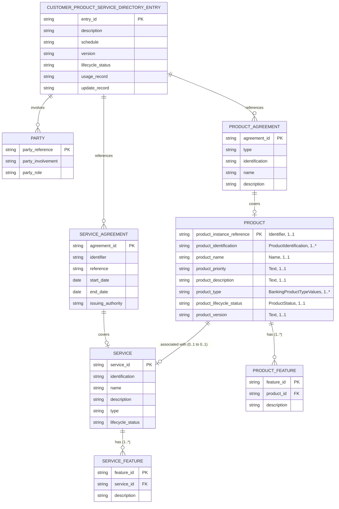

# Customer Product and Service Directory — Diagrama de Base de Datos

Fuente: [BIAN Service Landscape 13.0.0 — view_47556](https://bian.org/servicelandscape-13-0-0/views/view_47556.html)

Service Domain: **Customer Product and Service Directory**
Diagrama BIAN: Control Record (CR) Diagram, con sus Behavior Qualifiers (BQ) asociados.

## Modelo Entidad-Relación

## Descripción de Entidades

### CUSTOMER_PRODUCT_SERVICE_DIRECTORY_ENTRY (Control Record)
Entidad central del Service Domain. Mantiene el registro del directorio de productos y servicios de un cliente, incluyendo su descripción, cronograma (schedule), versión, estado del ciclo de vida y bitácoras de uso/actualización. Referencia a la parte (cliente), a los acuerdos de producto y a los acuerdos de servicio.

### PARTY
Representa a la parte involucrada (cliente). Atributos: referencia de la parte, tipo de involucramiento y rol.

### PRODUCT_AGREEMENT
Acuerdo de producto suscrito por el cliente. Define tipo, identificación, nombre y descripción del acuerdo, tipificado mediante `ProductAgreementTypeValues`.

### SERVICE_AGREEMENT
Acuerdo de servicio asociado. Incluye identificador, referencia, fechas de inicio/fin y autoridad emisora.

### PRODUCT (Behavior Qualifier)
Instancia de producto bancario contratado. Estructura detallada:

| Atributo | Tipo de dato | Cardinalidad |
|----------|--------------|--------------|
| Product Instance Reference (PK) | Identifier | 1..1 |
| Product Identification | ProductIdentification | 1..* |
| Product Name | Name | 1..1 |
| Product Priority | Text | 1..1 |
| Product Description | Text | 1..1 |
| Product Type | BankingProductTypeValues | 1..* |
| Product Lifecycle Status | ProductStatus | 1..1 |
| Product Version | Text | 1..1 |
| Product Feature (anidado) | Product Feature | 1..* |

Relaciones:
- Se vincula a nivel de Control Record con `PRODUCT_AGREEMENT` (el acuerdo comercial bajo el cual existe el producto).
- Mantiene una asociación **0..1** con `SERVICE` (Service Instance), bidireccional dentro del Control Record.
- Contiene 1..* `PRODUCT_FEATURE` como elemento anidado.

### SERVICE (Behavior Qualifier)
Instancia de servicio contratado: identificación, nombre, descripción, tipo (`ServiceTypeValues`) y estado del ciclo de vida. Tiene 1..* características (features).

### PRODUCT_FEATURE / SERVICE_FEATURE
Características particulares de cada producto o servicio (cardinalidad 1..*).

## Notas
- La asociación entre `PRODUCT` y `SERVICE` tiene cardinalidad **0..1 a 0..1**, es decir, un producto puede estar vinculado opcionalmente a un servicio y viceversa.
- Los tipos `ProductAgreementTypeValues`, `BankingProductTypeValues` y `ServiceTypeValues` son listas de valores controladas (enumeraciones) definidas por BIAN.
