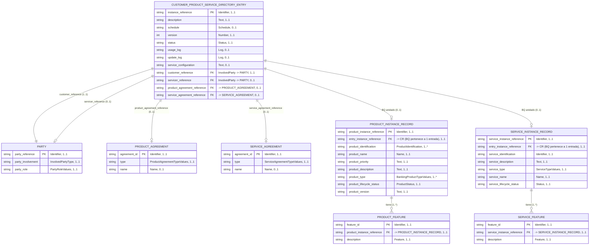

# Customer Product and Service Directory — Diagrama de Base de Datos

Fuente: [BIAN Service Landscape 13.0.0 — view_47556](https://bian.org/servicelandscape-13-0-0/views/view_47556.html)

Service Domain: **Customer Product and Service Directory**
Diagrama BIAN: Control Record (CR) Diagram, con sus Behavior Qualifiers (BQ) asociados.

## Modelo Entidad-Relación



## Gaps identificados y corrección

Al volver a cotejar el modelo contra el render oficial de BIAN (view_47556), se detectaron dos gaps:

- **`PRODUCT_AGREEMENT` y `SERVICE_AGREEMENT` no son entidades completamente detalladas en este diagrama.** En el render BIAN aparecen como **objetos de negocio referenciados** (cajas con atributos mínimos: identificador, tipo, nombre), no como Service Domains desarrollados. Su modelo completo (con fechas de vigencia, autoridad emisora, descripción extendida, etc.) pertenece a sus propios Service Domains — *Product Agreement* y *Service Agreement* respectivamente — fuera del alcance de *Customer Product and Service Directory*. Se corrigieron sus tablas de atributos para reflejar solo lo que el diagrama realmente expone.
- **(Corrección mayor) Los Behavior Qualifiers no cuelgan de los Agreements, sino del Control Record directamente.** El modelo anterior asumía que `PRODUCT_AGREEMENT` "cubre" (`covers`) a `PRODUCT_INSTANCE_RECORD` y que `SERVICE_AGREEMENT` cubre a `SERVICE_INSTANCE_RECORD`. Al revisar las líneas/cardinalidades reales del diagrama, **no existe esa asociación**: `PRODUCT_INSTANCE_RECORD` y `SERVICE_INSTANCE_RECORD` se asocian **directamente** al Control Record con cardinalidad 0..1, siguiendo el patrón estándar BIAN (CR ↔ BQ anidado). Las referencias a `*_AGREEMENT` son atributos paralelos e independientes del CR — apuntan a un objeto de negocio externo, pero no son el camino para llegar al BQ. También se eliminó la asociación inferida `PRODUCT_INSTANCE_RECORD ↔ SERVICE_INSTANCE_RECORD` (0..1 a 0..1): no hay evidencia de una línea directa entre ambos BQ en el diagrama; cada uno cuelga del CR de forma independiente.
- **`PARTY` corresponde al datatype `InvolvedParty`** que usa el CR (no a un Service Domain de Party Reference Data Management completo). Se mantiene como entidad simplificada en el ER por claridad, pero se aclara su alcance en la descripción.

Revisión adicional (análisis profundo contra el render BIAN):

- **`Product Type` es `[1..*]`, no `1..1`.** El render BIAN imprime `BankingProductTypeValues[1..*]`: un producto puede clasificarse bajo varios tipos a la vez. Se corrigió en el diagrama y en la tabla. (`Product Identification` y `Product Feature` también son `[1..*]`, ya estaban correctos.)
- **Se confirmó que la asociación CR ↔ BQ es `0..1`** en ambos extremos del lado BQ (cada entrada del directorio tiene como máximo una instancia de producto y una de servicio; el directorio completo de un cliente se compone de **varias entradas**, no de una sola entrada con muchos productos).
- **Se añadió la FK `entry_instance_reference` en ambos BQ** (`PRODUCT_INSTANCE_RECORD`, `SERVICE_INSTANCE_RECORD`) apuntando al Control Record. En BIAN el BQ es una estructura *anidada* dentro del CR y por eso no expone esa FK; pero al proyectarlo a un modelo relacional clásico (tablas con join) es necesaria para poder navegar de la instancia de producto/servicio de vuelta a su entrada de directorio. Se documenta explícitamente como añadido de modelado, no como atributo nativo BIAN.

## Identificadores: cómo se relacionan las entidades

BIAN no modela claves foráneas explícitas como un RDBMS tradicional; usa **referencias** (`Reference` / `Identifier`) dentro del Control Record que apuntan a las claves primarias de las entidades vinculadas. Para representarlo en un modelo relacional clásico, cada referencia del CR se trata como FK:

| Atributo en el CR | Tipo BIAN | Apunta a (PK) | Cardinalidad |
|---|---|---|---|
| `instance_reference` | Identifier | — (PK propia del CR) | 1..1 |
| `customer_reference` | InvolvedParty | `PARTY.party_reference` | 1..1 (obligatorio: todo directorio pertenece a un cliente) |
| `servicer_reference` | InvolvedParty | `PARTY.party_reference` | 0..1 (opcional: la unidad de negocio/servidor que administra el directorio) |
| `product_agreement_reference` | Reference | `PRODUCT_AGREEMENT.agreement_id` | 0..1 |
| `service_agreement_reference` | Reference | `SERVICE_AGREEMENT.agreement_id` | 0..1 |

Puntos clave sobre identificadores:
- **`PARTY` se reutiliza dos veces** desde el CR (como `customer_reference` y como `servicer_reference`), con roles distintos (`party_role`). No son dos tablas distintas, sino dos relaciones diferentes hacia la misma entidad `PARTY`.
- **`PRODUCT_INSTANCE_RECORD.product_instance_reference`** y **`SERVICE_INSTANCE_RECORD.service_instance_reference`** son identificadores propios de cada Behavior Qualifier (BQ). Cuelgan **directamente del CR** (asociación 0..1), no de `PRODUCT_AGREEMENT`/`SERVICE_AGREEMENT`.
- **`PRODUCT_FEATURE`** y **`SERVICE_FEATURE`** son entidades débiles: su PK (`feature_id`) solo tiene sentido en combinación con la FK hacia su entidad padre (`product_instance_reference` / `service_instance_reference`).
- **No existe asociación directa entre `PRODUCT_INSTANCE_RECORD` y `SERVICE_INSTANCE_RECORD`.** Ambos BQ son independientes entre sí; cada uno se vincula solo con el CR.
- **`PRODUCT_AGREEMENT.agreement_id` y `SERVICE_AGREEMENT.agreement_id`** son referencias hacia objetos de negocio externos a este Service Domain; aquí solo actúan como puntero (FK desde el CR) y no como PK de una entidad completamente modelada, y son independientes de la referencia del CR hacia el BQ.

## Cadena cliente → producto

La relación "cliente tiene este producto" no es directa entre `PARTY` y `PRODUCT_INSTANCE_RECORD`; se reconstruye recorriendo el Control Record, que es quien conecta ambos extremos:

```
PARTY (cliente)
   ▲  customer_reference (1..1)
   │
CUSTOMER_PRODUCT_SERVICE_DIRECTORY_ENTRY
   │  BQ anidado (0..1)
   ▼
PRODUCT_INSTANCE_RECORD
   │  tiene (1..*)
   ▼
PRODUCT_FEATURE
```

No existe una arista directa `PARTY ||--o{ PRODUCT_INSTANCE_RECORD` en el modelo: el Control Record es el único punto que conoce a la vez al cliente (`customer_reference`) y a la instancia de producto (BQ anidado 0..1). El `PRODUCT_AGREEMENT` es una referencia **paralela e independiente** del CR — identifica el acuerdo comercial, pero no es el camino que conduce al `PRODUCT_INSTANCE_RECORD`.

## Descripción de Entidades

### CUSTOMER_PRODUCT_SERVICE_DIRECTORY_ENTRY (Control Record)
Entidad central del Service Domain. Es el "índice maestro" de todos los productos y servicios que un cliente tiene contratados con el banco.

| Atributo | Tipo de dato | Cardinalidad | Descripción |
|---|---|---|---|
| Instance Reference (PK) | Identifier | 1..1 | Identificador único de la entrada del directorio. |
| Description | Text | 1..1 | Descripción libre de la entrada. |
| Schedule | Schedule | 0..1 | Calendario/cronograma asociado (p. ej. fechas de revisión). |
| Version | Number | 1..1 | Número de versión del registro. |
| Status | Status | 1..1 | Estado del ciclo de vida de la entrada (activo, cerrado, etc.). |
| Usage Log | Log | 0..1 | Bitácora de uso del directorio. |
| Update Log | Log | 0..1 | Bitácora de actualizaciones/cambios. |
| Service Configuration | Text | 0..1 | Configuración específica de cómo se presta el servicio. |
| Customer Reference (FK) | InvolvedParty | 1..1 | Referencia al cliente (`PARTY`) propietario del directorio. |
| Servicer Reference (FK) | InvolvedParty | 0..1 | Referencia a la parte que administra/sirve el directorio (`PARTY`). |
| Product Agreement Reference (FK) | Reference | 0..1 | Acuerdo de producto vinculado. |
| Service Agreement Reference (FK) | Reference | 0..1 | Acuerdo de servicio vinculado. |

### PARTY (datatype `InvolvedParty`)
Representa a cualquier parte involucrada en la entrada del directorio (cliente o servidor). No es un Service Domain detallado en esta vista — corresponde al datatype `InvolvedParty` que el CR usa dos veces, una por cada rol.

| Atributo | Tipo de dato | Cardinalidad | Descripción |
|---|---|---|---|
| Party Reference (PK) | Identifier | 1..1 | Identificador único de la parte. |
| Party Involvement | InvolvedPartyType | 1..1 | Tipo de involucramiento (cliente, servidor, etc.). |
| Party Role | PartyRoleValues | 1..1 | Rol concreto que juega la parte en esta relación. |

### PRODUCT_AGREEMENT (objeto de negocio referenciado)
Acuerdo de producto suscrito por el cliente, referenciado en paralelo desde el CR. **No se detalla por completo en este Service Domain**: el diagrama solo expone identificador, tipo y nombre; el resto de su estructura (vigencia, partes firmantes, términos) pertenece al Service Domain *Product Agreement*. No tiene asociación directa con `PRODUCT_INSTANCE_RECORD` — ambos son referenciados de forma independiente por el CR.

| Atributo | Tipo de dato | Cardinalidad | Descripción |
|---|---|---|---|
| Agreement ID (PK) | Identifier | 1..1 | Identificador único del acuerdo. |
| Type | ProductAgreementTypeValues | 1..1 | Tipo de acuerdo (lista de valores controlada por BIAN). |
| Name | Name | 0..1 | Nombre del acuerdo. |

### SERVICE_AGREEMENT (objeto de negocio referenciado)
Acuerdo de servicio asociado, referenciado en paralelo desde el CR. **No se detalla por completo en este Service Domain**: el diagrama solo expone identificador, tipo y nombre; el resto de su estructura pertenece al Service Domain *Service Agreement*. No tiene asociación directa con `SERVICE_INSTANCE_RECORD` — ambos son referenciados de forma independiente por el CR.

| Atributo | Tipo de dato | Cardinalidad | Descripción |
|---|---|---|---|
| Agreement ID (PK) | Identifier | 1..1 | Identificador único del acuerdo. |
| Type | ServiceAgreementTypeValues | 1..1 | Tipo de acuerdo de servicio (lista de valores controlada por BIAN). |
| Name | Name | 0..1 | Nombre del acuerdo. |

### PRODUCT_INSTANCE_RECORD (Behavior Qualifier)
Instancia de producto bancario contratado, cardinalidad **0..1 respecto al Control Record** (un directorio puede no tener una instancia de producto activa, pero solo puede tener una por entrada).

| Atributo | Tipo de dato | Cardinalidad | Descripción |
|---|---|---|---|
| Product Instance Reference (PK) | Identifier | 1..1 | Identificador único de la instancia de producto. |
| Entry Instance Reference (FK) | Identifier | 1..1 | Referencia al Control Record (`CUSTOMER_PRODUCT_SERVICE_DIRECTORY_ENTRY`) al que pertenece este BQ. No aparece como atributo en el render BIAN (el BQ está anidado); se añade aquí para que el modelo relacional sea navegable. |
| Product Identification | ProductIdentification | 1..* | Identificaciones del producto (puede tener varias, p. ej. número de cuenta + código interno). |
| Product Name | Name | 1..1 | Nombre comercial del producto. |
| Product Priority | Text | 1..1 | Prioridad del producto para el cliente. |
| Product Description | Text | 1..1 | Descripción del producto. |
| Product Type | BankingProductTypeValues | 1..* | Tipo(s) de producto bancario; en BIAN se muestra como `[1..*]`, un producto puede clasificarse bajo varios tipos. |
| Product Lifecycle Status | ProductStatus | 1..1 | Estado del ciclo de vida del producto. |
| Product Version | Text | 1..1 | Versión del producto. |
| Product Feature (anidado) | Product Feature | 1..* | Características del producto, modeladas como `PRODUCT_FEATURE`. |

### SERVICE_INSTANCE_RECORD (Behavior Qualifier)
Instancia de servicio contratado, cardinalidad **0..1 respecto al Control Record**.

| Atributo | Tipo de dato | Cardinalidad | Descripción |
|---|---|---|---|
| Service Instance Reference (PK) | Identifier | 1..1 | Identificador único de la instancia de servicio. |
| Entry Instance Reference (FK) | Identifier | 1..1 | Referencia al Control Record (`CUSTOMER_PRODUCT_SERVICE_DIRECTORY_ENTRY`) al que pertenece este BQ. No aparece en el render BIAN (BQ anidado); se añade para que el modelo relacional sea navegable. |
| Service Identification | Identifier | 1..1 | Identificación del servicio. |
| Service Description | Text | 1..1 | Descripción del servicio. |
| Service Type | ServiceTypeValues | 1..1 | Tipo de servicio (lista de valores BIAN). |
| Service Name | Name | 1..1 | Nombre del servicio. |
| Service Lifecycle Status | Status | 1..1 | Estado del ciclo de vida del servicio. |
| Service Feature (anidado) | Feature | 1..* | Características del servicio, modeladas como `SERVICE_FEATURE`. |

### PRODUCT_FEATURE
Entidad débil que detalla las características particulares de un `PRODUCT_INSTANCE_RECORD`. No existe sin su producto padre.

| Atributo | Tipo de dato | Cardinalidad | Descripción |
|---|---|---|---|
| Feature ID (PK) | Identifier | 1..1 | Identificador de la característica. |
| Product Instance Reference (FK) | Identifier | 1..1 | Referencia al producto padre. |
| Description | Feature | 1..1 | Descripción de la característica del producto. |

### SERVICE_FEATURE
Entidad débil que detalla las características particulares de un `SERVICE_INSTANCE_RECORD`. No existe sin su servicio padre.

| Atributo | Tipo de dato | Cardinalidad | Descripción |
|---|---|---|---|
| Feature ID (PK) | Identifier | 1..1 | Identificador de la característica. |
| Service Instance Reference (FK) | Identifier | 1..1 | Referencia al servicio padre. |
| Description | Feature | 1..1 | Descripción de la característica del servicio. |

## Notas
- El Control Record (`CUSTOMER_PRODUCT_SERVICE_DIRECTORY_ENTRY`) es el único punto de entrada al directorio: tanto los BQ (`PRODUCT_INSTANCE_RECORD`, `SERVICE_INSTANCE_RECORD`) como las referencias a `*_AGREEMENT` cuelgan **directamente** de él, de forma paralela e independiente entre sí.
- `PRODUCT_INSTANCE_RECORD` y `SERVICE_INSTANCE_RECORD` **no tienen asociación directa entre sí**; cada uno es un BQ independiente anidado 0..1 en el CR.
- Los tipos `ProductAgreementTypeValues`, `ServiceAgreementTypeValues`, `BankingProductTypeValues`, `ServiceTypeValues`, `InvolvedPartyType` y `PartyRoleValues` son listas de valores controladas (enumeraciones) definidas por BIAN, no texto libre.
- `PARTY` se referencia dos veces desde el CR con cardinalidades distintas (`customer_reference` 1..1 obligatorio, `servicer_reference` 0..1 opcional), lo que refleja que toda entrada de directorio requiere un cliente, pero no necesariamente un servidor explícito distinto del banco.
